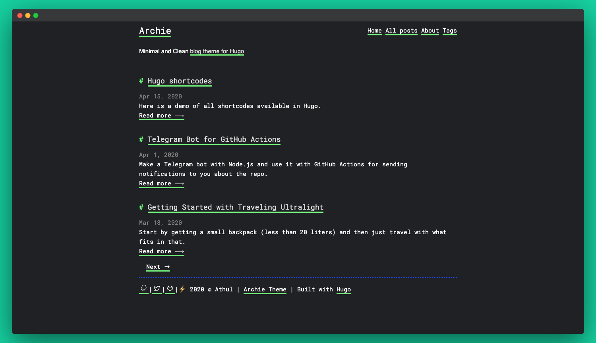

## The Issue
So I have written the two blogs ([The Laptop Proxmox Blog](/posts/old-laptop-into-proxmox-server), and [Laptop NAS build](/posts/laptop-nas)), but I don't have a way to share them. I have written in [markdown](https://www.markdownguide.org/getting-started/) file (via [Obsidian](https://obsidian.md/)), since it would be easy for me to write them. The problem is that you can't just put a markdown file into a web server and expect it to work. So I would need to find a way to convert them into [HTML](https://en.wikipedia.org/wiki/HTML). So after a some research, I have developed a plan. 


*The plan for creating blog articles from markdown files.*

As you can see, there will be a lot of setup needed for this to work. But after all of that, writing a new blog will be easier since I would just need to run a bash script to automatically publish it. 


## Setup the Structure
The first thing I did is install [hugo](https://gohugo.io/). In case you don't know what hugo is, hugo is a static site generator<sup>[1]</sup>. Essentially, it takes a blueprint of a website, and turn it into an actual website that can be hosted<sup>[1]</sup>.  Since I have zero experience with hugo, I followed their [quickstart page](https://gohugo.io/getting-started/quick-start/). I ran the following commands from their docs:

```bash
hugo new project quickstart
cd quickstart
git init
git submodule add https://github.com/gohugo-ananke/ananke themes/ananke
echo "theme = 'ananke'" >> hugo.toml
hugo server
```

Basically, what that code snippet does is create a new project called `quickstart`, create a new git repo inside the `quickstart`, import and used the `anake` theme, and start the server. The server is hosted at `http://localhost:1313`.


*The folder structure that hugo project creates.*


*What the hugo website looks like after creating the project.*

Now the website looks bland, and that's because it's missing content in it. Meaning that the next thing I would have to do is import content into hugo. So I copied the [Proxmox Laptop Server](/posts/old-laptop-into-proxmox-server) markdown file into `quickstart/content` folder. And this is what the first paragraph looks like without any changes made to it. Not only that, but hugo (or ananke, not sure which one) automatically put the blog into the home page.


*Hugo rendering the raw markdown file of the blog from Obsidian.*


*The blog automatically being placed in the home page.*

## Making the Blog Compatible with Hugo
So at first glace, the markdown files seems to work just fine with Hugo. But take a closer look at it, and you would notice some issues.


*The first paragraph from the markdown file. Notice how not everything isn't being render properly.*

From that screenshots, there are two things that isn't being render properly, the superscript and the images. The first one that I wanted to tackle is the superscript. The reason why it might not be rendering properly  how it looks behind the scene.

``` html
<sup>[1]</sup>
```

As you can tell, that is raw HTML being placed inside markdown. Now hugo seems to be ignoring raw HTML being used. This makes sense, as allowing raw HTML be parsed could be used as an exploit. However, this will will only be an issue if you don't know that HTML is being injected into the markdown (EX: an AI model sneaking in malicious HTML when generating the markdown). Since all of the text, including the HTML, is being written by me, I can trust myself that I wont inject malicious HTML (or can I?). So to disable that, I would have to insert the following into the `hugo.toml` file<sup>[2]</sup>:

```toml
[markup] 
  [markup.goldmark]
	  [markup.goldmark.renderer] 
		  unsafe = true
```


*The superscripts now being rendered properly.*

With that fixed, the next thing I have to fix is the images not loading. The reason why they're not being loaded is that Obsidian uses an non-conventional way of loading images in markdown, [backlinks](https://obsidian.md/help/plugins/backlinks). So I would need to convert them into a markdown standard so that Hugo can understand them. But before I can do that, I would need to tell Hugo where the images are stored at. Becuase of the way that backlinks work in Obsidian, Obsidian will be able to link to them, regardless of where they are in the vault<sup>[3]</sup>. So because of this, Obsidian's back links are only the name of the file.

To do that, I would be using [Hugo's page bundles](https://gohugo.io/content-management/page-bundles/). What page bundles are is a way of organising the page's content by putting all of the relevant content in the same folder<sup>[4]</sup>.   There are two types of page bundles, leaf bundles, and branch bundles. The difference between them is that the leaf bundles has no child bundles inside of it, while a parent bundles does <sup>[4]</sup>. Since the blogs isn't going to have nested blogs inside of them, a leaf bundles makes more sense. So I reorganise the blogs to be leaf bundles.  


*The new blog folder structure as a leaf bundle.*

Now with the reorganisation, it will make loading the images easier. All I would have to do is tell Hugo that the image is in the same spot as the markdown file. But that will only work after I convert the Obsidian's backlinks into markdown's images format. In case you don't know how markdown images are formatted, it is as follows: ``.  Since I have the image's alt text as the image's caption, I can just leave that blank. That leaves the converted format to be ``.


*The convert image format not loading.*

Except that it didn't work, even with the alt text in it. My guess is that the spaces in the image name is breaking it. But no matter what combination of `-`, `_`, `/`, `\`, `"`, or `'`, it still wouldn't load. Eventually, I found out that the spaces has to be replaced with `%20` for it to work<sup>[5]</sup>.


*The image being properly render in Hugo.*

## Theme Things Up.
With the markdown being render correctly, it's time to move on to the most important decision of my life, picking what theme to go with. With 100s of themes to pick from, picking one is almost going to be impossi- I picked [archie](https://github.com/athul/archie). 



*The Archie showcase images from their [repo](https://github.com/athul/archie).* 

Archie wasn't the first theme I picked. I was browsing the [theme's repo page](https://themes.gohugo.io/), and saved the ones that look interesting. The ones I've saved are [Terminal](https://github.com/panr/hugo-theme-terminal#how-to-start),  [Hugo Blog Awesome](https://github.com/hugo-sid/hugo-blog-awesome), [Diary](https://github.com/AmazingRise/hugo-theme-diary), [Hugo Theme Console](https://github.com/mrmierzejewski/hugo-theme-console), and [archie](https://github.com/athul/archie). From there I tested all of them to see which one I like, and which one I didn't like. 

But the thing is, I couldn't even do that for two of them because they threw an error at me. To be more specific, the Hugo Blog Awesome and the Diary theme both to an RSS error at me. so I had to immediately eliminate them from being used. Now, yes, obviously I could have spent some time trying to debug the error and fix it. But I was too lazy to do that. So I just move on to the other teams.


*The Hugo Awesome Blog theme throwing an error about `rss.xml` file*


*The Diary theme throwing an error about `rss.xml` file*

The good thing is that the Terminal theme, the Console theme, and the Archie theme all work just fine without editing errors.


*The Terminal theme not auto loading any of the blogs.*


*The Hugo Theme Console theme not auto loading any of the blogs.*


*The Archie theme not auto loading any of the blogs.*

Alright, there might have been an error with those three themes.  But that's because they were expecting the blogs to be in `content/posts` instead of just `content`.  


*A snippet of the first blog in the Terminal theme on both desktop and mobile. *


*A snippet of the first blog in the Hugo Theme Console theme on both desktop and mobile. *


*A snippet of the first blog in the Archie theme on both desktop and mobile. *

Eventually, I went with Archie because it's the cleanest theme while also looking the best on mobile. 

## Features & Site Cleanup
The next thing I wanted to do is figure out how to setup RSS. Seeing the RSS error in the Diary theme and the Hugo Awesome Blog theme gave me the idea to set that up.  Turns out, Hugo automatically creates an RSS feed when it builds the server<sup>[6]</sup>. So all I would have to do is to navigate to `http://localhost:1313/index.xml`, and the file needed for RSS to work will appear. 


*A screenshot of the RSS file.*

Now I just need an easy way for people to access the RSS file. That's when I saw that Hugo has an option to create buttons for menu entries<sup>[7]</sup>.  By adding the following to the `hugo.toml` file, the `blogs`, `about`, and `rss` buttons will be created.

``` toml
 [[ menu.main ]]
  name="blogs"
  url = "/posts/"
  weight = 1

[[ menu.main ]]
  name="about"
  url = "/about/"
  weight = 2

[[ menu.main ]]
  name="rss"
  url = "/index.xml"
  weight = 3     
```


*The menu buttons being created.*

The `blogs` button links to the page that is a list of all of the blogs.  The `about` button will link to the about page for the site. For the about page to exist, I would have to put the `about.md` file into the `content`. 


*The blog page that shows all of the articles.*


*The about page.*

Alright, now it's time to deal with the fact that the blogs look empty and ugly. The reason why is that they're missing metadata.  Hugo uses Front Matter for the page's metadata<sup>[8]</sup>. So after spending some time reading the doc page, I added the following front matter into the start of the first blog.

``` text
---
date: 2026-05-20T14:34:00
title: Turning an Old Laptop into a Proxmox Server
slug: Old Laptop Into Proxmox Server
description: I try to turn an old laptop into a Proxmox server, but struggle in the process due to factors out of my control.
tags:
  - Proxmox
  - Laptop
  - Server
  - Fixing
  - Hardware
  - Lots of Issues
---
```

Most of the values are pretty self explanatory, except for the `slug` value. What `slug` value is the value of the last segment in the URL. For example, instead of the url being `http://localhost:1313/posts/01_proxmox_server`, it will instead be `http://localhost:1313/posts/Old-Laptop Into-Proxmox-Server` . I can also import the front matter into obsidian to make it easier to enter them in when writing.


*The new overview of the blog in the home page.*


*The tags at the end of the blog.*

I then check if Archie has any additional front matter options, and I saw that they have a `toc` option. What this option does is adds in a table of contents to the page. The table of contents will be pinned in place, staying in spot as you scroll. But the thing is the table of contents doesn't work when the heading aren't being used with `#`. So I had to change all of them into `##`.


*The tables of content created by Archie.*


*The table of contents being pinned to place as you scroll along.*

It is annoying me that the width of the article gets smaller because of the table of contents. There is a lot of dead space that could have been taken up by the blog's content. So after a quick search, I found out that I can modify the theme's style without messing with the source files. What I can do is create a local clone of the CSS file, and place it into the `assets` file with the same folder structures<sup>[9]</sup>. 

But before I can do that, I would need to figure out which value to modify. So using Firefox's inspect element, I was quickly able to figure out that I would need to modify the `--content-max-width` in the ":root" class. I also use the sliders in the inspect element to find out that I would want to change the value from `800px` to `1110px`. The last thing I would need to do is find the `.css` file that has the `--content-max-width` value.  So after I find out that the value is in the `main.css` file, I copied it into the `assets/css/`, and change the value.


*The blog now has more space due to the custom css file.*

Knowing this, I also wanted to fix how some of the image's caption will be on the same line instead of below it. So using the same trick before, I inserted the following into the css file. This will force the caption to be in a new line, and make some extra space as well.

```css
em {
  display: block;
  margin-bottom: 10px;
}
```


*An example of the image caption not working as intended.*


*An example of the image caption working after I fix it.*

I then saw that Archie has a search feature built into it. To  use it, I would have to make a `search.md` file into the root of the `content` folder, and place the following into that file. I also added it as one of the menu's button.
```
---
title: "Search"
layout: "search"
outputs:
  - html
  - json
---
```


*Archie's built in search bar in action.*

The only thing that the site is now missing is dark mode, and Archie has support for that. By adding the `mode` value into `hugo.toml`, I can tell what Hugo what color theme to set it to. My options are `light`, `dark`, `auto`, and `toggle`. I went with toggle for more user control, as it adds the toggle button in the top right.


*The site in dark mode via the toggle.*


The final thing I would need to do is to create a new Hugo site for the actual blog, as this one was just for testing. So I ran `hugo new site Mr.Tinkerer` to create it. Since this is the actual one I want to use, I will be actually using git to make commit between changes and blog creations. So this will the final version of the `hugo.toml` file:

```toml
## baseURL = 'https://example.org/'
locale = 'en-us'
title = "Mr.Tinkerer's Blogs"
theme = 'archie'

[params]
mode = "toggle"
useCDN = false
subtitle = "Mr.Tinkerer's Blog site for documenting his progress with tinkering with tech."
description = "Welcome to my blog site, where I document my progress tinkering with tech projects."

[markup]
  [markup.goldmark]
    [markup.goldmark.renderer]
      unsafe = true

[[ menu.main ]]
  name="Blogs"
  url = "/posts/"
  weight = 1

[[ menu.main ]]
  name="Search"
  url = "/search/"
  weight = 2

[[ menu.main ]]
  name="About"
  url = "/about/"
  weight = 3

[[ menu.main ]]
  name="RSS"
  url = "/index.xml"
  weight = 4
```
## Automate the Blog Conversion
So after spending many hours overthinking things, googling things, banging my head onto the desk, and even *asking AI for help with the script (so scary)*, I was finally able to create the script that will auto convert the obsidian markdown into generic markdowns for Hugo to use. Note that the script is only halfway done, since I would need to make it publish it as well. But that's for later me to deal with. 

```bash
#!/bin/bash

#get the starting time in milliseconds
START=$(date +%s%3N)

#store where the markdown files are, and where to put the converted one at
MD_FOLDER="$HOME/Documents/Obsidian/Mr.Tinkerer/Blogs"
BLOG_FOLDER="$HOME/Documents/Mr.Tinkerer/content/posts"

#create the blog folder if it doesn't exist
if [[ ! -e $BLOG_FOLDER ]]; then 
    mkdir -p $BLOG_FOLDER
    echo "Created the blog folder."
fi
```

The first part of the script is just defining the constant variables to use in the script. The `START` is for timing how long the script take to execute, in milliseconds, and the `MD_FOLDER` and `BLOG_FOLDER` is for defining where the important folders are stored at.  It also creates the blog folder if it doesn't exist.


```bash
#list of markdowns that will be converted
mds_to_convert=()

#go through all of the folders in the markdown folder, and get the basename 
for md in $MD_FOLDER/*; do
    md_base=$(basename "$md")

    #skip looking into the blog folder if it's empty
    if [[ -n $(ls -A $BLOG_FOLDER) ]]; then
        
        #assumes that the blog doesnt exist
        ADD=true
        
        #go through all of the folders in the blog folder, and get the basename
        for blog in $BLOG_FOLDER/*; do
            blog_base=$(basename "$blog")

            # if the markdown base does exist in the blog, then skip it 
            if [[ $md_base == $blog_base ]]; then
                ADD=false
                continue
            fi
        done

        #add the markdown to the list of conversion
        if [[ $ADD = true ]]; then
            echo "'$md_base' doesn't have a blog, yet"
            mds_to_convert+=("$md_base")
        fi

    else
        #auto add it to the list, since the blog folder is empty
        mds_to_convert+=("$md_base")
    fi 
done
```

This part is all about finding out which blogs to convert, instead of doing all of them. I feel like that if I made it have to convert every single blog in the site, it would take a while, especially if there are hundreds of blogs to convert.  

So what it does is that it first creates a list of markdown files to convert. Then it'll iter over every single folder in the obsidian folder. Then it checks if the blog folder is empty. If it is, It'll automatically adds every single markdown to the list . If the blog folder isn't empty, then it will first assume that the blog version doesn't exist. Then it will check the blog folder if it has a folder with the same name. If it does, then it knows that the blog version exist, and skip it. If it can't find the blog version, then it is added to the list. 

```bash
#copy over each article to the blog folder
for md_article in "${mds_to_convert[@]}"; do
    #copy the markdown's article folder to the blog folder
    md_path="$MD_FOLDER/$md_article"
    cp -r "$md_path" "$BLOG_FOLDER"
    echo "Copied over the $md_article over to the blog folder."

    #go into the blog article path
    cd "$BLOG_FOLDER/$md_article"

    #renamed the .md file into index.md for hugo
    for file in *.md; do
            mv "$file" index.md
            echo "Renamed '$file' to index.md"
            break
    done

    #replace all heading 1 (#) with heading 2 (##) for the table of contents to work
    sed -i "s/^# /## /g" index.md
    echo "Fixed the table of contents for $md_article"

    #iter through every obsidian backlink for images 
    #(NOTE: this line was generated by Google's Gemini cause I couldn't figure out how to do it by hand)
    grep -oP '(?<=!\[\[).*?(?=\]\])' index.md | while IFS= read -r line; do
        #replace spaces with %20 for compability
        safe_img=$(echo $line | sed "s/ /%20/g")

        #replace all of the obsidian backlink with markdown link with the safe version
        sed -i -E "s/!\[\[$line\]\]//" index.md
    done
    echo "Fixed the images for $md_article"
done
```

Now this is the part where the magic happens. It will go through every markdown file in the list, and actually convert them. Since I want the source file to still be in the same shape as before, it will make a copy of it into the blog folder, and rename the markdown file into `index.md`, since the Hugo's leaf bundle need it<sup>[4]</sup>.  Then it will use `sed` to change all of the headings in the file from heading 1 (#) to heading 2 (##). 

Then It will fix the images. It will first do this by using `grep` to get a list of images using the Obsidian's backlink in the file. Now I do what to note that the `grep`  line was generated by Google's Gemini, since I couldn't figure out how to do it myself. While I was able to figure out how to use regex to filter for the Obsidian's backlink, I couldn't figure out how to only return the content inside the backlink. That's where Gemini instead use `grep`'s Peral regex mode to extract the text, which I would have never figure out myself. Not only that, but Gemini also use `IFS= read -r line` to be able to iter over each line and store it as the `line` variable.  From there, I first use `sed` to convert all spaces into `%20` to make it URL friendly<sup>[10]</sup>. Finally, I use the second `sed` to replace the old Obsidian's backlink with the new markdown links.  

```bash
#generate the static site
cd "$BLOG_FOLDER/../.."
hugo
```
I then tell the script to go to the root of the Hugo folder, and generate the static version the site. 

```bash
#caculate how long the script take to execute, and say it
END=$(date +%s%3N)
duration=$(( END - START ))
echo "This script took $duration ms to run." 
```

The last thing that the scipt does, for now, is to calculate how long the script took to execute. This is done by getting the current time, in milliseconds, and subtracting it from the starting time.  This isn't important at all, but it would be nice to know.
## Don't Forget about Backlinks & Tags
I am jumping the gun here, as I almost forgot to convert obsidian's backlinks for articles into markdown links. For context, this is what the backlinks looks like in the [Laptop NAS blog post](/posts/laptop-nas): `[[Turning an Old Laptop into a Proxmox Server|turned an old laptop into a Proxmox server].]` Everything before the `|` is the name of the file, and everything after that is the alternative name for the link. 

So I just gotta put into the following format: `[turned an old laptop into a Proxmox server](Turning an Old Laptop into a Proxmox Server)`. Except that wont work, as it will set the link to  "`http://localhost:1313/Turning an Old Laptop into a Proxmox Server`". Even if I replaces the spaces with `%20`, it still wont work because of A: the blogs are located under `/posts`, and B: the the internal name will be different then what's on the URL. Even then, that doesn't matter because the link to the blogs are using slugs instead of the file name.

This left me scratching my head for a bit as I try to figure out the best way for the script to somehow know what slug to use for the article. Eventually I came up with the script generating a list of markdown files, and their slugs associated with it. The list will be formatted like this: `name of the file.md|slug: blog's slug`. With this list, I can just lookup the slug associated with the file from one spot, instead of scanning the entire directory & sub directories.  I also tell the script to always create a new file of it. The reason why is that is encase the slug get's updated in the future, then the file will point to the new one. 

```bash
#The slug file for storing the file's name and their slug assoications
SLUG_FILE="$BLOG_FOLDER/../../slug.txt"

#delete the file before creating it. easier then checking what's already in there and not adding it
if [[ -e "$SLUG_FILE" ]]; then
    rm $SLUG_FILE
fi
touch $SLUG_FILE

#get all of the markdown files in the obsidian folder, and loop over it
find $MD_FOLDER -name "*.md" | while IFS= read -r line; do
    #get the slug name, and the basename of the file
    slug=$(grep "slug: " "$line" --max-count 1)
    md_file=$(basename "$line")

    #format the output and append it to the file
    echo "$md_file|$slug" >> $SLUG_FILE
done
```

Then from there I tell the script to look for every instance of double square brackets in the file. However, Obsidian's backlinks isn't the only thing that uses double square brackets (for example, Bash uses them for conditions). So I would have to tell it to only look for the ones that have a pipe in it. I did had t use Google's Gemini to generate me the regex statement for `grep`, since I couldn't get it to return just only the text inside the double square brackets. Then from there, I would use `awk` to split the Obsidian's backlinks in half at the `|`. From there, I would use the file name from the backlink to find the slug related to it in the `slug.txt` file,  extract the slug, lowercase it, and replace the spaces with dashes. Finally, I had the script create the markdown version of the link, and use `sed` to replace the backlink with the markdown link.

```bash
#iter through every obsidian backlink for articles 
#(NOTE: this line was generated by Google's Gemini cause I couldn't figure out how to do it by hand)
grep -oP '\[\[\K[^\]]*\|[^\]]*(?=\]\])' index.md | while IFS= read -r line; do
	#split the line into the file part, and the alt text part 
	link_file=$(echo "$line" | awk -F '|' '{print $1}')
	alt_text=$(echo "$line" | awk -F '|' '{print $2}')

	#look for the slug that's for the file referenced, extract it, lowercase it, and replace all spaces with -  
	slug_result=$(grep "$link_file" $SLUG_FILE)
	slug=$(echo $slug_result | awk -F '|slug: ' '{print tolower($2)}')
	slug=$(echo $slug | sed "s/ /-/g")

	#create the markdown version of the link
	new_link="[$alt_text](\/posts\/$slug)"

	#replace the obsidian backlink with the markdown link
	sed -i "s/\[\[$line\]\]/$new_link/" index.md
done
echo "Fixed the backlinsk for $md_article"
```

Although while I was doing that, I realise that I wanted to tweak the tags so they would have spaces in them. For some reason, Obsidian doesn't allow spaces in the front matter version of tags, but Hugo does. And I would prefer if the tags do have spaces. So I made the script extract the front matter from the markdown file, extract the tags from the front matter, and replace any dashes with spaces. 

``` bash
#extract the tags from the file
#(NOTE: this line was generated by Google's Gemini cause I couldn't figure out how to do it by hand)
front_matter=$(awk '/^---$/ {p++; next} p==1 {print}' index.md)
tags=$(echo "$front_matter" | grep "^  - ")

#replace the tag's _ with spaces
echo "$tags" | while IFS= read -r line; do
	new_tag=$(echo "$line" | sed "s/_/ /")
	sed -i "s/$line/$new_tag/" index.md
done
echo "Fixed tags for $md_article"
```


## Prepare to Host
Since the blog is almost ready to go live, there is a few cleanup things I would want to do. The first one is that I want the Git repo to have a separate branch that's just the `public` folder. This should make hosting the site easier since it would just have the generated files only in it.  Luckily for me, Git has a built in feature for that called Worktree. A Git worktree is a feature that can assign an directory to a branch<sup>[11]</sup>. So I can have everything, except for `public` into the main repo, and `public` into the site repo.

To use it, I would have to first ensure that the public directory doesn't exist, as the worktree would make the directory. Then, I would run `git worktree add --orphan -b site public`. What that command would is is create a new worktree at the `public` directory, with the `site` branch (`-b site`), and make it not in have the history of the main branch (`--orphan`). From there, running `hugo` would put the static files in both the `main` branch, and the `site` branch. I would still have to manually commit to them, but that's where the script comes in, as I can just automate that. To do that, I would have to first commit inside the site folder, then commit the main folder.
## Publishing the Blog Site
With the blog's repo ready to be public, I have decided to create a Github account to not only host the repo, but to also host the blog site. I went with Github because A) I needed a place to host the blog's source code, and B) they can host static pages for free*.
*\*There are limits to how the website can be hosted on Github, such as the site being no bigger then 1GB.<sup>[12]</sup>*

So I created a brand new [Github account](https://github.com/Mr-Tinkerer) for the blog posts. I then uploaded a newly generated SSH key for it, since that's what I would be using to push the blog repo, and I create the GitHub repo (https://github.com/Mr-Tinkerer/mr-tinkerer.github.io) for it. After pushing the main branch, and the site branch, I went into the repo's settings to find the option to create a Github Page. From there, I told it to `Depoly from a branch`, with the branch being `site`, and the folder being `/root`.


*The setting page for creating the Github Page for the blog.*

And after giving Github some time to deploy the site automatically, it is now live @ https://mr-tinkerer.github.io/Blog-Site/.


*The website after I published it.*

Except that the site is broken. Not only that the CSS is broken, but also the URLs. I clicked on any of the URLs, and they take me to `/posts/Laptop-NAS` instead of `https://mr-tinkerer.github.io/posts/Laptop-NAS/`. I reran the `hugo server` command to see if the script broke the site, but it still works there, meaning that the issue is at the generation of the static site.  

So the first thing that I went to go check is the `hugo.toml`, and that's when I notice that the `BaseURL` is not only set to `https://example.org/`, but also commented out. That explains why the URLs are broken. So I set it to the Github URL, and rebuild the site. I then check the `index.html`, and saw that the links were now pointing to the Github URL. I then pushed the fix to Github, and waited for the site to auto redeploy. After some time, Github said that the changes is now live. However, when I went to go check on the site, it is still broken as before. 

I went to go check on the `index.html` file in the Github repo, and that's when I notice that it's missing the Github URL. But when I check the latest commit in the `site` branch, it's at the commit where the Github URL is added. I went back to the local git repo to check the status, and it's up to date with the remote repo. I tried to do another push, but with force this time, and it still in the broken spot. Not only that, but when I click on the `public` directory in the `main` branch, it does nothing. So with those two issues, I decided to just delete the `site` worktree and branch, and just have Github Pages deploy from the `public` directory. Except I can't do that, as Github Pages only give me two directory options when I choose to `deploy from a branch`.


*The two folder options I am allow to choose.*

At this point, I decided to use my brains cells and check if there is a guide on how to deploy a Hugo blog to a Github Page. And sure enough, there is an official guide from the [Hugo's docs](https://gohugo.io/host-and-deploy/host-on-github-pages/#types-of-sites). Interesting enough, it doesn't tell you to use the `deploy from a branch` option, but instead the `Github Actions`. Now I never use Github Actions before, so this will be interesting.  

So after the guide tells you to switch the deployment option to Github Actions, it want you to add the following into the `hugo.toml` file. 

```toml
caches:
  images:
    dir: :cacheDir/images
```

From there, it wants you to create a Github Action file at `.github/workflows/hugo.yaml` in the local repo. This file will tell Github when to run the action, and how to build and deploy the site. Now I don't understand it fully on how it works, but I get an general idea from skimming over it.

```yaml
name: Build and deploy
on:
  push:
    branches:
      - main
  workflow_dispatch:
permissions:
  contents: read
  pages: write
  id-token: write
concurrency:
  group: pages
  cancel-in-progress: false
defaults:
  run:
    shell: bash
jobs:
  build:
    runs-on: ubuntu-latest
    env:
      DART_SASS_VERSION: 1.99.0
      GO_VERSION: 1.26.2
      HUGO_VERSION: 0.161.1
      NODE_VERSION: 24.15.0
      TZ: Europe/Oslo
    steps:
      - name: Checkout
        uses: actions/checkout@v6
        with:
          submodules: recursive
          fetch-depth: 0
      - name: Setup Go
        uses: actions/setup-go@v6
        with:
          go-version: ${{ env.GO_VERSION }}
          cache: false
      - name: Setup Node.js
        uses: actions/setup-node@v6
        with:
          node-version: ${{ env.NODE_VERSION }}
      - name: Setup Pages
        id: pages
        uses: actions/configure-pages@v6
      - name: Create directory for user-specific executable files
        run: |
          mkdir -p "${HOME}/.local"
      - name: Install Dart Sass
        run: |
          curl -sLJO "https://github.com/sass/dart-sass/releases/download/${DART_SASS_VERSION}/dart-sass-${DART_SASS_VERSION}-linux-x64.tar.gz"
          tar -C "${HOME}/.local" -xf "dart-sass-${DART_SASS_VERSION}-linux-x64.tar.gz"
          rm "dart-sass-${DART_SASS_VERSION}-linux-x64.tar.gz"
          echo "${HOME}/.local/dart-sass" >> "${GITHUB_PATH}"
      - name: Install Hugo
        run: |
          curl -sLJO "https://github.com/gohugoio/hugo/releases/download/v${HUGO_VERSION}/hugo_extended_${HUGO_VERSION}_linux-amd64.tar.gz"
          mkdir "${HOME}/.local/hugo"
          tar -C "${HOME}/.local/hugo" -xf "hugo_extended_${HUGO_VERSION}_linux-amd64.tar.gz"
          rm "hugo_extended_${HUGO_VERSION}_linux-amd64.tar.gz"
          echo "${HOME}/.local/hugo" >> "${GITHUB_PATH}"
      - name: Verify installations
        run: |
          echo "Dart Sass: $(sass --version)"
          echo "Go: $(go version)"
          echo "Hugo: $(hugo version)"
          echo "Node.js: $(node --version)"
      - name: Install Node.js dependencies
        run: |
          [](/posts/) && npm ci || true
      - name: Configure Git
        run: |
          git config core.quotepath false
      - name: Cache restore
        id: cache-restore
        uses: actions/cache/restore@v5
        with:
          path: ${{ runner.temp }}/hugo_cache
          key: hugo-${{ github.run_id }}
          restore-keys:
            hugo-
      - name: Build the site
        run: |
          hugo build \
            --gc \
            --minify \
            --baseURL "${{ steps.pages.outputs.base_url }}/" \
            --cacheDir "${{ runner.temp }}/hugo_cache"
      - name: Cache save
        id: cache-save
        uses: actions/cache/save@v5
        with:
          path: ${{ runner.temp }}/hugo_cache
          key: ${{ steps.cache-restore.outputs.cache-primary-key }}
      - name: Upload artifact
        uses: actions/upload-pages-artifact@v5
        with:
          path: ./public
  deploy:
    environment:
      name: github-pages
      url: ${{ steps.deployment.outputs.page_url }}
    runs-on: ubuntu-latest
    needs: build
    steps:
      - name: Deploy to GitHub Pages
        id: deployment
        uses: actions/deploy-pages@v5
```

Once I pushed the Github Actions file to Github, it immediately, started to build it. After a minute, the new version of the site is now live. And this time it works exactly how it should.


*The fixed version of the site.*

## Github Repo for the script
https://github.com/Mr-Tinkerer/mr-tinkerer.github.io/tree/script

## Citations
> [1] Hugo. “Introduction.” _Gohugo.io_, 3 Apr. 2024, gohugo.io/about/introduction/. Accessed 24 May 2026.
> [2] Hugo. “Configure Markup.” _Gohugo.io_, 16 Mar. 2026, gohugo.io/configuration/markup/#rendererunsafe. Accessed 24 May 2026.
> [3] Anderson, Dominic. “How to Use Backlinks in Obsidian.” _Alphr_, 23 Aug. 2023, www.alphr.com/obsidian-how-to-use-backlinks/. Accessed 24 May 2026.
> [4] Hugo. “Page Bundles.” _Gohugo.io_, 18 May 2026, gohugo.io/content-management/page-bundles/. Accessed 24 May 2026.
>  [5] Chris. “How to Escape Spaces in Filename When Including Image in Markdown?” _Stack Overflow_, Stack Overflow, 10 July 2020, stackoverflow.com/a/62833782. Accessed 24 May 2026.
>  [6] Hugo. “RSS Templates.” _Gohugo.io_, 25 Feb. 2026, gohugo.io/templates/rss/. Accessed 27 May 2026.
>  [7] Hugo. “Configure Menus.” _Gohugo.io_, 25 May 2026, gohugo.io/configuration/menus/#example. Accessed 27 May 2026.
>  [8] Hugo. “Front Matter.” _Gohugo.io_, 24 May 2026, gohugo.io/content-management/front-matter/. Accessed 27 May 2026.
>  [9] irkode. “Adding Custom.css to Hugo Modules.” _HUGO Discourse_, Hugo, 28 Sept. 2025, discourse.gohugo.io/t/adding-custom-css-to-hugo-modules/55989/2. Accessed 28 May 2026.
>   [10] Blender. “The Origin on Why “%20” Is Used as a Space in URLs.” _Stack Overflow_, 16 Dec. 2012, stackoverflow.com/a/13900863. Accessed 30 May 2026.
>   [11] NameOcean. “NameOcean | Find Your Treasure in Domain Name Ocean.” _Nameocean.net_, 29 May 2026, nameocean.net/article/supercharge-your-git-workflow-how-worktree-based-team-coordination-transforms-collaborative-development/. Accessed 31 May 2026.
>   [12] Github. “GitHub Pages Limits - GitHub Docs.” _GitHub Docs_, docs.github.com/en/pages/getting-started-with-github-pages/github-pages-limits. Accessed 3 June 2026.