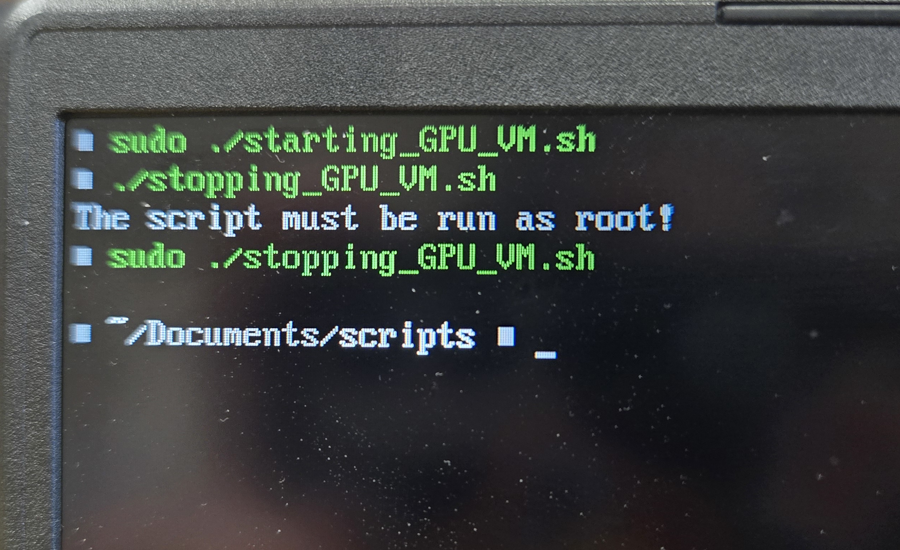

## The Plan
So I want to create a VM (Virtual Machine) that's designed to let me able to game inside it. Not only that, but at the end, I want make giving the VM my GPU as easy as possible. Now there are many reasons why someone would want to set something like this up, but there are two for me. 

The first is that if I am encountering an issue with [Valve's Proton](https://github.com/ValveSoftware/Proton) (which is a tool that makes it easy to run Windows game under Linux)<sup>[1]</sup>, I want to be able to use that VM to confirm that the issue is coming from Proton, and not the game being buggy. Now I know that I could just re-import the game into my Window's drive, and test it their. But not only that would require me to reboot my laptop to access Windows, but additional storage would be wasted, as I would have to copy the game's files over to Windows. I could just, instead, share the game's folder into the VM. The second reason is that there might be some times where I would want to test some software that I don't fully trust. By putting those software into the VM, and giving the VM my GPU, I could run those software to the fullest power while still isolating it from my host system. 

## Prerequisites
It is also important to note that before I can even start this, I would need two things. The first thing is that I would need two GPUs in order to do this. Now they don't have to be two dedicated GPUs, as the second one could just be an Integrated GPU (the GPU that's inside the CPU). The reason why is that when you give the VM the GPU, you're OS will no longer have access to it.<sup>[2]</sup> So the second GPU will be there to ensure that the OS can still render things properly.<sup>[2]</sup> 

The second thing that you will need is an Intel CPU that supports VT-d (or VT-x), or an AMD chip that supports AMD-Vi<sup>[2]</sup>. What those feature do is that they will make VMs able to use the hardware more efficiently. If you have an AMD CPU that's from the bulldozer generation or higher (October 2011 or higher), then it has AMD-Vi built into it.<sup>[2]</sup> For Intel, using the [Intel compatible website checker](https://ark.intel.com/content/www/us/en/ark/search/featurefilter.html?productType=873&0_VTD=True&2_VTX=true) will let you know which ones has VT-d (or VT-x).<sup>[2]</sup>  Not only that, but you would need an motherboard that supports IOMMU.<sup>[2]</sup> IOMMU allows the devices to be more efficiently mapped to the system's RAM.<sup>[5]</sup> This will make it easier for the VM to access the physical hardware. <sup>[5]</sup>

The third thing that you would need is a monitor that you can plug your GPU and IGPU into. If you're on a desktop computer, then you should already have one.  If you only have one monitor, then I would recommend getting two monitors so that one of them can be plugged into the GPU, and the other into the IGPU at the same time. If you can't get a second monitor, then you could either borrow one from someone you know, or juggle between plugging between the GPU and the IGPU. 

The last thing that you will need is any modern Linux Distro. I'll explain more in detail when I get to the hypervisors section, but just know that the tools being used here doesn't support Windows, nor Mac OS. 

With that being said, I am using a [GIGABYTE-GAMING-A16-GA6H](https://www.gigabyte.com/Laptop/GIGABYTE-GAMING-A16-GA6H) gaming laptop on [CachyOS](https://cachyos.org/) (mandatory "I use Arch, btw"). 
## Prepare for the VM
Obviously, The first step would be to get the Windows ISO. Now I am going to use the Windows 10, as I feel like modifying the VM to meet Windows 11 requirements, and bypassing the requirement for connecting a Microsoft account just to be able to install Windows. Not only that, but since this VM will almost never be connected to the internet, I don't have to worry about future Windows 10 vulnerability affecting the machine. Now luckily for me, Microsoft is still hosting the ISO image for [Windows 10](https://www.microsoft.com/en-ca/software-download/windows10iso). 


*The download button for Window 10's ISO.*

Now the next question is what VM platform should I use? Before I can pick that, I can already eliminate some options, since a type 2 hypervisor won't work with this. If you don't know what a type 2 or a type 1 hypervisor is, then let me quickly explain. A type 1 and a type 2 hypervisor are different types of virtual machine platform. A type 2 live on top of the existing OS (Windows, Mac, Linux, etc...), while a type 1 hypervisor lives on top of the physical hardware.<sup>[5]</sup> Because type 2 hypervisor lives on top of an OS, it would have to fight against the OS in order to use the hardware efficiently.<sup>[5]</sup> So because of that, the VMs would not only be slower, but it would also be extremely harder to give the VM full access to the physical hardware, like a GPU<sup>[5]</sup>. Type 1 hypervisor don't have this issue because they're the only ones who have access to the hardware, giving them complete control over it<sup>[5]</sup>.  So any type 2 hypervisor platforms, like [VirtualBox](https://www.virtualbox.org/) and [VMWare Workstation](https://www.vmware.com/products/desktop-hypervisor/workstation-and-fusion), are out of the question.   

But the next question would be which type 1 hypervisor to use? The problem with type 1 hypervisors is that since they avoid existing OS, then the only way for me to put them onto my host system is to install their OS for it. But then it won't be friction-less if I would have to reboot my device just to use the VM. Luckily for me, there's one hypervisor that lets me use it on my existing Linux Distro, and that's [QEMU](https://www.qemu.org/). QEMU is a powerful VM that can run VMs on top of any modern Linux Distro.<sup>[6]</sup> Now this does make it a type 2 hypervisor. But QEMU has support for other hypervisors, including KVM.<sup>[6]</sup> KVM is a virtualization module that's built into the modern Linux kernel.<sup>[7]</sup> So by using KVM, QEMU can bypass the OS, and have direct access to the physical hardware via by the Linux Kernel<sup>[7]</sup>. This turns it into a type 1 hypervisor.

Now I do want to note that Microsoft does have a type 1 hypervisor that's can run on top of Windows 8 and above.<sup>[8]</sup> The problem is that it's locked behind the Pro and Enterprise version of the consumer version of windows.<sup>[8]</sup> 

That being said, one problem with QEMU is that it's command line only.  It has no way of saving the configuration of the VM, so you would have to run the same command everytime. This is an example of an command taken from [andreavouk's guide on QEMU](https://andreavouk.com/blog/2024/09/15/qemu-practical-noob-guide-101):
``` bash
/opt/qemu/bin/qemu-system-x86_64 \
    -enable-kvm \
    -cpu host \
    -smp 4 \
    -m 4096 \
    -netdev user,id=net0 -device virtio-net-pci,netdev=net0 \
    -device virtio-scsi-pci -drive file=demo-ubuntu24.qcow2,if=none,id=hd0,cache=writeback -device scsi-hd,drive=hd0 \
    -cdrom './ubuntu-24.04-desktop-amd64.iso' \
    -device usb-ehci,id=usb,bus=pci.0 \
    -device usb-tablet
```

As you can see, it can be complex to control and manage the VMs like this. Luckily for us, there are external tools to make it easier to manage QEMU's VMs. One such tool is [libvirt](https://libvirt.org/). Libvirt is a toolkit that handles managing QEMU for us.<sup>[9]</sup> It saves the VM's config as a XML, making it simpler to start the VM. Unfortunately, it is still command line based only. It is not as bad as QEMU.  The last tool that would be needed is [Virt Manager](https://virt-manager.org/). Virt manager is a GUI wrapper for libvirt, and by extension, QEMU.<sup>[10]</sup> 


*An example of Virt Manager from their website.<sup>[10]</sup>*

## Setting up the VM
With all of that out of the way, I can finally get around to creating the VM. With the Windows 10 ISO in my hand, I created a new VM for it. The VM is set to have 16GB of RAM, and 6 CPU cores. The RAM usage might be overkill, but I just want to ensure that the VM can handle anything I throw at it. The same can't be said for the storage, as I only give it 64GB. I want the main disk to just be small enough to host Windows, and the drivers needed onto it. When I get to the final screen, I select the `Customize configuration before install`, as I want to make some changes to it before installing.


*The memory and CPU cores settings. *


*The Storage Settings.*


*Selected the customize configuration befroe install option.*

The first thing that  I have to change is the topology of the CPU. You see, when I set the CPU cores earlier, it didn't actually gave the VM 6 CPU cores. Instead, it gives the VM 6 CPU sockets by default. I'm not sure why it does that by default, but I do know that I would have to manually change it for Windows to perform better, or else it will only use one core. I also disabled the NIC interface in the VM. The reason why is that I want to setup Windows 10 offline so I don't have to go through the process of logging into a Microsoft account.


*The updated CPU topology.*


*The NIC being disabled.*

With those two being set, I begin the installation of Windows 10. The VM booted into the ISO, and I begin the installation. I'm sure that you have install Windows 10 before, so I'm going to skim over this. The first thing I did is that I didn't provided a licence key Windows, since I don't feel like paying for Windows. I also went with the `Windows 10 Home` version.  Finally, I told it to take the entire drive, and begin the installation.


*License key not being provided to Windows.*


*Windows 10 home being used.*


*The entire drive being used.*


*Windows being installed.*

After Window 10 installed, I got to the setup screen. After selecting the country and keyboard layout, I got to the part where it ask to connect Windows to the network. But I wouldn't be able to do that since I "unplugged" the ethernet cable. Since I didn't go with Windows 11, I am able to select `I don't have internet`. Microsoft did try to convince me to connect to the internet so I can connect an Microsoft account, but I can just skip it since I'm not on Windows 11.


*No network connection appearing, and Windows allowing me to skip connecting to the network.*


*Microsoft trying to convince me to connect a Microsoft account, but I can skip it.*

I then got to the part where it ask me to create a local user. I set the username to be `Owner`, the password to be `password`, and the security answers to be `Owner`. Clearly, this is a very secure account that definitely wont easily be hacked. But it doesn't matter for this VM since it's almost never going to talk to the internet. After that, Windows 10 has been successfully been installed. 


*The VM being sucessfully installed.*

With the installer now being in the past, I can re-enable the NIC to install drivers. After a minute of the NIC being enabled, Window 10 was able to detected and connect to it. 


*The NIC being re-enabled.*


*Windows seeing that the NIC was re-enabled.*

Now as of right now, the only drivers I would need to install is the VirtIO drivers. The VirtIO drivers is a set of drivers that allow Windows to work better with the devices.<sup>[11]</sup> As of the time that I am writing this, the following devices are support with the drivers:<sup>[11]</sup>
- Disk drivers
- Ethernet cards
- Dynamic Memory Management. 

In addition to that, the drivers also came with the QEMU guest agent drivers. What the QEMU guest agent does is that allows information to be exchanged between the host and guest.<sup>[12]</sup> This is useful for the following, but not limited to, reasons:<sup>[12]</sup>
- Properly shutdown the guest VM from the host device.
- Freeze the guest file system when making a backup/snapshot. It will also use volume shadow copy service if the guest OS is Windows.
- Automatically resize the guest's display size when the VM window has been resized.

Now the drivers are being maintain by the Fedora Project,<sup>[13]</sup> and the download URL can be found at their [website repo](https://fedorapeople.org/groups/virt/virtio-win/direct-downloads/archive-virtio/virtio-win-0.1.285-1/). I installed the `virtio-win-guest-tools.exe` option inside the VM. From there, I just ran the file, and just clicked next on every popup window. I didn't want to mess with the installer, so I went with the default options. After installing it, I shutdown the VM, and removed the CD drive that contain the Windows 10 ISO.


*The VirtIO driver's repo.*


*The VirtIO driver installer wizard.*


*The CD drive being deleted from the VM.*

The last thing that I did to the VM is that I Windows download any of the updates that it's missing. From there, I let the machine download the update, and auto restart a few time to install the updates. Once it was done being updated, I created a snapshot of this point to have a updated version 


*The Windows update that the VM is missing.*


*The VM being updated.*


*The snapshot of the updated state being created.*

## Setting up IOMMU

With the basic VM setup, it's time to move on to preparing for passing the GPU into the VM. Now, this first step is only needed if you have a Intel CPU, as AMD CPUs already has this applied, but you would need to tell the Linux kernel to boot with `IOMMU` enabled. Now doing this depends on which boot manager you are using. If you are using [GRUB](https://www.gnu.org/software/grub/), then you would need to modify the `GUB_CMDLINE_LINUX_DEFAULT` variable inside `/etc/default/grub` to append `intel_iommu=on` to it.<sup>[14]</sup> An example of what line would look like is `GUB_CMDLINE_LINUX_DEFAULT="quiet splash intel_iommu=on"`.<sup>[15]</sup> From there, you would run `grub-mkconfig -o /boot/grub/grub.cfg` to generate a new config file, with the modifications you applied to it, for GRUB to use on boot.<sup>[15]</sup>

However, when I was installing CachyOS, I instead went with [Limine](https://github.com/Limine-Bootloader/Limine), as it was the default option for CachyOS. So the steps that I took was similar with GRUB. So what I had to do is that I had to open the `/etc/default/limine` file.<sup>[16]</sup> From there, I appended the `intel_iommu=on` value to the `KERNEL_CMDLINE[default]` line, just like how I would do it in GRUB.<sup>[16]</sup>  The last thing I would need to do is run the `limine-mkinitcpio` command to apply the kernel parameters to all of them.

Now this is the part where AMD users can come back in, because we would need to reboot the system into the BIOS. From here, you would need to look for the `VT-D` option for Intel CPUs, or `CBS` for AMD CPUs, if you didn't already enabled this earlier.<sup>[14]</sup>  You would also need to look for the `IOMMU` option. However, my device didn't have the `IOMMU` option in the BIOS.<sup>[14]</sup> If yours don't have it, then it still might be able to work. You would just need to boot into Linux, and run the following command `sudo dmesg | grep -i IOMMU`.<sup>[14]</sup> If you see something along the lines of `DMAR: IOMMU enabled`, then it's enabled.<sup>[14]</sup>


*What the option looked like on my BIOS.*

Now that IOMMU is enabled, the next step would be to see how IOMMU group the various PCI devices.<sup>[17]</sup> The Arch Wiki has provided a simple bash script to easily see the IOMMU groups:<sup>[17]</sup>

```bash
#!/bin/bash
shopt -s nullglob
for g in $(find /sys/kernel/iommu_groups/* -maxdepth 0 -type d | sort -V); do
    echo "IOMMU Group ${g##*/}:"
    for d in $g/devices/*; do
        echo -e "\t$(lspci -nns ${d##*/})"
    done;
done;
```

When you run that script, you should see a whole bunch of IOMMU groups. If you just the GPU, the GPU audio controller, and any other physical features that's being listed in the group, then you are good.<sup>[17]</sup> If you see any other devices in the same group, then you would have to pass that device as well.<sup>[17]</sup> If you don't want pass them as well, then try moving your GPU to a different slot, if possible, to generate a different IOMMU group.<sup>[17]</sup> The following is an snippet example of what the script's output look like for me.

```c
IOMMU Group 15:
	01:00.0 VGA compatible controller [0300]: NVIDIA Corporation GB206M [GeForce RTX 5060 Max-Q / Mobile] [10de:2d19] (rev a1)
	01:00.1 Audio device [0403]: NVIDIA Corporation GB206 High Definition Audio Controller [10de:22eb] (rev a1)
IOMMU Group 16:
	02:00.0 Non-Volatile memory controller [0108]: Phison Electronics Corporation PS5021-E21 PCIe4 NVMe Controller (DRAM-less) [1987:5021] (rev 01)
IOMMU Group 17:
	03:00.0 Non-Volatile memory controller [0108]: Samsung Electronics Co Ltd NVMe SSD Controller SM981/PM981/PM983 [144d:a808]
IOMMU Group 18:
	04:00.0 Ethernet controller [0200]: Realtek Semiconductor Co., Ltd. RTL8111/8168/8211/8411 PCI Express Gigabit Ethernet Controller [10ec:8168] (rev 15)
```

## Prepare the GPU for the VM
Now that the GPU is isolated in a separate group, it's time to prepare the GPU. To do this, we would need to tell the Linux kernel to not let any programs to touch the GPU.<sup>[18]</sup> To do this, we can give the GPU a VFIO driver, during the boot process, before the NVIDIA drivers take the GPU.<sup>[18]</sup> However, this will make the GPU unusable by the system until the VFIO driver is gone.<sup>[18]</sup> 

To do this, we must first get the PCI devices by their IDs. Luckily for us, there's already an easy way to do that. When we ran the script for the IOMMU groups, the PCI's IDs were listed inside the `[:]` at the very end of the line.<sup>[19]</sup> For example, for my RTX 5060 Mobile GPU, the IDs are listed as `[10de:2d19]`.  You're going to want to write them down somewhere, as it is going to be used a lot in this section.

The next step would be to tell the kernel what devices should be use the VFIO driver. To do this, you would use need to create a new kernel module. This can be done by using [modprobe](https://www.man7.org/linux/man-pages/man8/modprobe.8.html) by creating the `/etc/modprobe.d/vfio.conf` file.<sup>[20]</sup> Inside that file, the following line would need to be added: `options vfio-pci ids=<INSERT_LIST_OF_IDS_HERE_WITH_COMMA_AND_NO_SPACES>`.<sup>[19]</sup> An example of what that line would look like would be `options vfio-pci ids=10de:2d19,10de:22eb`.<sup>[20]</sup>

But that file alone won't be enough, as the NVIDIA driver would take the GPU before VFIO can. Doing this would depend on which initramfs generator your distro is using. If you're unsure, then the following command will tell you which of the popular ones are installed on your system: `which dracut mkinitcpio update-initramfs mkinitrd booster`. If it return more then one path, then you would have to search up which one is being primarily used. In my case, CachyOS (and vanilla Arch Linux) uses `mkinitcpio`.

After you find your initramfs generator, you would need to tell the initramfs to load the VFIO module (the `vfio.conf` made earlier) before the NVIDIA driver. Now doing this properly will depend on the initramfs generator you're using. The Arch Wiki has instructions for [mkinitcpio, booster, and dracut](https://wiki.archlinux.org/title/PCI_passthrough_via_OVMF#initramfs). Since CachyOS is using `mkinitcpio`, I will be following that one. But the instructions should be simillar for the other initramfs. 

What I would need to is modify the `/etc/mkinitcpio.conf`.<sup>[21]</sup> From there, I would have to modify the `MODULES=()` line to include `vfio_pci vfio vfio_iommu_type1` into it.<sup>[21]</sup> So that line would look like `MODULES=(vfio_pci vfio vfio_iommu_type1)`.  If the `MODULES` has the `nvidia` module in there, then make sure it's at the end of the line to load after VFIO.<sup>[21]</sup> I would also have to ensure that the `HOOKS=` line has the `modconf` hook inside it.<sup>[21]</sup> So it should look something like `HOOKS=(... modconf ...)`. Finally, I would have to rebuilt the mkinitcpio via `mkinitcpio -P`.<sup>[21]</sup>  However, since I am using `limine` as my boot manager, the command for me would me `limine-mkniitcpio -P`.<sup>[16]</sup>

After that, you would reboot the machine to reload the drivers. This is the part where I would recommend having two monitors plugged into the GPU and IGPU. The reason why is that if your monitor is only plugged into the GPU, then you'll be stuck into a black screen. Remember that Linux isn't using the GPU, so nothing will display from the GPU. So the only output that will Linux will be using is the IGPU. Having the two monitors will let you immediately see this, and know that the system booted properly. If you don't have a second monitor, then you will have to switch your cable to the IGPU. 

To fully confirm that your GPU is using VFIO drivers,  you can run the following command for each PCI device `lspci -nnk -d <INSERT_PCI_ID>` (`lspci -nnk -d 10de:2d19`).<sup>[22]</sup> If you see the `Kernel driver in use: vfio-pci` line, then the GPU is using the VFIO drivers.<sup>[22]</sup> Your also going to want to write down the PCI numbers in front of the GPU name in the command output. This will be useful when we pass the GPU into the VM. In my case, the numbers are `01:00.0`, and `01:00.1`.

```powershell
$ lspci -nnk -d 10de:2d19
01:00.0 VGA compatible controller [0300]: NVIDIA Corporation GB206M [GeForce RTX 5060 Max-Q / Mobile] [10de:2d19] (rev a1)
	Subsystem: Gigabyte Technology Co., Ltd Device [1458:6019]
	Kernel driver in use: vfio-pci
	Kernel modules: nouveau, nvidia_drm, nvidia
$ lspci -nnk -d 10de:22eb
01:00.1 Audio device [0403]: NVIDIA Corporation GB206 High Definition Audio Controller [10de:22eb] (rev a1)
	Subsystem: NVIDIA Corporation Device [10de:0000]
	Kernel driver in use: vfio-pci
	Kernel modules: snd_hda_intel
```

## Insert the GPU into the VM
With the GPU separated, it's now time to insert it to the VM. This will be simple to do with Virt Manager. With the Hardware page of the VM open, you're going to want to click the "Add Hardware" button.  From there, you're going to want to select the "PCI Host Device". 


*The location to add in a PCI device in Virt Manager.*

Now you will see all of the PCI devices in the device. From there, you will select the PCI device with the same name as the physical device. If you're unsure about the actual name, or you would want to be 100% sure that it's the right device, then that's where the written PCI numbers from earlier come in. Picking the device that has the same PCI number will ensure that it's the right device. Remember to add all of the PCI devices in the same IOMMU group from earlier. 


*The PCI selection list.*

From there, you would want to start the VM up. If you do have your GPU plugged into a monitor, then the monitor might still be undetected when the VM is being used. This is because we're missing the GPU drivers for the display to work properly. So you would have to install the GPU drivers for it to work. Once you install the drivers, the GPU will now be able to display stuff to the second screen. 


*The monitor that's connected to the GPU working after installing the NVIDIA drivers.*

## Looking into the Glass
So with the GPU inside the VM, the next step would be to use [Looking Glass](https://looking-glass.io/). Looking Glass is a tool that will allow you to control your VM with low latency.  It does this by reading the raw, unfiltered, frames from the GPU.<sup>[24]</sup>

In order for Looking Glass to read the GPU's frames, it will need IVSHMEM to be setup first.<sup>[25]</sup>  IVSHEM (Inter-Vm SHared MEMory) is a device that will alllow a memory region to be shared between the host and guests.<sup>[26]</sup>  To figure out how big to make the memory, you would have to do the following calculations:<sup>[27]</sup> 
1. Take the width and height of the desired maximum resolution, and multiply them. 
2. Then multiply the resolution by the BPP. The BPP is the Bits Per Pixel. BPP is 4 for SDR, and 8 for HDR.   
3. Multiply the number by 2 to get the frame size in bytes.
4. Divide the fame size by 1,048,576 to convert the frame size into MiB.
5. Add the frame size by 10 to get the required size.
6. Find the nearest power of 2 number, and round up to that.

For example, I would want to calculate the IVSHMEM for 1920x1200 SDR display:
1. 1920 x 1200 = 2,304,000
2. 2,304,000 x 4 = 9,216,000
3. 9,216,000 x 2 = 18,432,000
4. 18,432,000 / 1,048,576 = 17.578125
5. 17.578125 + 10 = 27.578125
6. The nearest power of two number that is bigger then 27 is 32.
- So for my IVSHMEM, it should be 32MIB.

With the IVSHMEM calculated, its time to add it to the VM, while it's power off, with Virt Manager. Unfortunately, there's no easy way to add a IVSHMEM without manually editing the XML file. To do so, you would first have to allow XML editing. To do so, you would have to go to `Edit` -> `Preferences`. Then from there, go to the `General` tab, and check `Enable XML editing`.


*The preference option settings.*


*The option to allow XML editing.*

Then, go to the hardware option of the VM, select the `Overview` option, and click onto the `XML` tab. This will show the entire XML file for the VM.


*The XML file editing in Virt Manager.*

From there, you will want to add the following XML snippet to the end of the file.<sup>[28]</sup>  Make sure that it's has the correct number in there, in MiB, and it's above the `</devices>` section of the XML file.<sup>[28]</sup> 

```xml
<shmem name='looking-glass'>
  <model type='ivshmem-plain'/>
  <size unit='M'>INSERT SHARED MEMORY HERE</size>
</shmem>
```


*An example of what it should look like in the XML file.*

The next thing that you would have to do is to create a config file that will create the shared memory file on boot.<sup>[28]</sup> To do so, you would have to put the following into the `/etc/tmpfiles.d/10-looking-glass.conf`.<sup>[28]</sup> Just make sure to replace the `user` value with the username of your actual user.<sup>[28]</sup> After that, you can run `systemd-tmpfiles --create /etc/tmpfiles.d/10-looking-glass.conf` to make systemd to create the temp file now.<sup>[28]</sup> 

``` bash
##  Path                    Mode  UID   GID  Age  Argument
f  /dev/shm/looking-glass  0660  user  kvm  -    -
```

The last thing that you have to do is install the Looking Glass Client application for your host device. Installing this will depend on your system. If it's not on there, then you will have to [manually compile it](https://looking-glass.io/docs/B7/install_client/). But for Arch based distros, there's a [AUR package](https://aur.archlinux.org/packages/looking-glass) that will handle the compiling for you.

Now that IVSHMEM is setup for the VM, and Looking Glass Client is installed, it's time to install the Looking Glass Server into the VM. Now I am not sure why, but whenever I reboot right after installing the drivers, the mouse no longer works in Virt-Manager. The keyboard still works, so you can use that to navigate around. Or you can set the mouse to be redirected into the VM by `USB Host Device`. Regardless of which way you pick, you will have to install the `Windows Host Binary` from the download page of Looking Glass. From there, you would just click next on everything. Just make sure that the `IVSHMEM Driver` is checked off for installation. 


*The Windows Host Binary to install inside the VM.*


*What components to install. Ensure that the IVSHMEM driver is installed.*

Now with the GPU plugged into the monitor, you can set the video hardware to be `None` to make the GPU the only display. After starting the VM, start Looking Glass. If you don't then it will exit since there's no VM's SPICE server to connect to. After that, give it a minute for Windows to boot, and the Looking Glass Server to start. If there's no output to the monitor, and the CPU usage is flat-line at one number, then try disabling ROM BAR for the GPU.<sup>[29]</sup>


*The CPU flating at one percentage, and being flat-lined.*


*Where to disable the ROM BAR.*


*Looking Glass Client loading the VM display.*

But right now, there's an issue with the setup. The GPU will have to be connected to an monitor for it to display something. This can be annoying to deal with, as you're either going to be down a monitor, or can't be portable with this setup. There are two ways to fix this. The first one is buying a dummy plug for the HDMI/DP port in the GPU. This will make the GPU think that there's a monitor connected to it, when there isn't. The second option is to use a virtual display to trick the system into thinking there is a monitor plugged in. To do this, we'll be using a tool called [Virtual Display Driver](https://github.com/VirtualDrivers/Virtual-Display-Driver). 

First, you will want to install the latest release from the Github Repo. Then you will want to extract the zip folder, and run `VDD Control.exe`. This will bring up a GUI to control the virtual display. From there, you will want to click the `Install Driver` button. During the installation, there will be a popup asking if you want to add the virtual display driver. Answer yes to that. After that, you can close the Virtual Driver Control window. To ensure that the virtual display is working, you can look for it in `Device Manager` ->  `Display Adapters`. After you see it in there, then you can unplug the monitor, and Looking Glass will continue to work. 


*The Virtual Driver Control GUI.*


*The Virtual Display Driver.*

At this point, the only issue I had left was that the resolutions in the virtual display was all in 16:9, but my monitor was in 16:10. Virtual Display Driver does have a way to add in custom resolutions. I would have to modify the `C:\VirtualDisplayDriver\vdd_settings.xml` file. I added the following into the `<resolutions>` tag.

```xml
<resolution>
  <width>1920</width>
  <height>1200</height>
  <refresh_rate>30</refresh_rate>
</resolution>
```

Don't worry about the refresh rate being set to 30. There is another option in the file to set the refresh rate, and those will be applied to all resolutions. But after I restart the driver in Virtual Driver Control's GUI, I was able to set the resolution to `1920x1200@165` in the windows settings.

## VFIO Drivers -> Nvidia Drivers
So the VM is all setup and ready to be used. The only problem is that it it's a pain to use the VM. If I would what to use the VM, I would have to modify the `/etc/mkinitcpio.conf` file, rebuilt the initramfs, reboot the laptop, and finally be able to use it. That's too much friction for me to be wanting to be able to use it. So I would have to find a way to unbind and rebind the GPU's drivers without reboot the machine. Now this would be the harder part for me, since almost everything up to this point I've done before. So most of this was just me retracing my older steps, and remembering why something does a specific thing. The only new part was the Virtual Display Driver tool, since I never heard about it until I stumble upon it.

What I would want to start with is unbinding the VFIO driver, and rebinding it to the Nvidia drivers. The reason why is that I figured that it would be easier to deal with, since I don't have to deal with trying to unbind the Nividia driver when something is currently using it. A quick search online tells me that echoing the PCI numbers into the right file will tell the kernel to unbind the drivers.<sup>[30]</sup>  But I need to know the right PCI numbers as the `01:00.0` wasn't a directory in `/sys/bus/pci/devices`.


*The PCI devices listed on my device.*

That's when I remember that Virt Manager's hardware tab had a longer number for the PCI devices. And sure enough, those numbers were in the `/sys/bus/pci/devices`.  With the correct numbers obtained, I quickly wrote the following bash script for testing if this works. 

```bash
#!/bin/bash
gpu="0000:01:00.0"
aud="0000:01:00.1"
echo $gpu > /sys/bus/pci/devices/$gpu/driver/unbind
echo $aud > /sys/bus/pci/devices/$aud/driver/unbind
```

And sure enough, the GPU was no longer bind to anything. Now I just need to bind it to the Nvidia GPU. To do that, I would just need to throw the PCI number to the driver's `bind` file. For me, those drivers are the `nvidia` for the GPU, and `snd_hda_intel` for the GPU's audio.  Now obviously, those drivers will be different for your system. Which is why running `lspi -nnk` will tell you what drivers your device normally use when not using VFIO.


*The output of `lspci` after unbinding VFIO. Notice how the results are missing the `Kernel driver in use:` line.*

``` bash
echo $gpu > /sys/bus/pci/drivers/nvidia/bind
echo $aud > /sys/bus/pci/drivers/snd_hda_intel/bind
```

And sure enough, the GPU is back to being normal. A quick `nvidia-smi` command confirms that. Incase you don't know what `nvidia-smi` is, it is a command that lets you monitor the nvidia's GPU.<sup>[31]</sup> 


*The GPU being back to normal after rebinding the drivers back to it.*


## Nvidia Drivers -> VFIO Drivers 
Now that was the easy part. Nothing was using the GPU when the VFIO drivers was loaded. However, with the Nvidia drivers, anything can be using the GPU. In my Laptop's idle state, there are two applications that's currently using my GPU, Steam and [Niri](https://github.com/niri-wm/niri). Now Steam would be easy to kill. Niri, on the other hand, isn't. The reason why is that it's the window manager I am currently using. So killing it would lead me to not have a way to spawn and controls windows onto my machine.   


*The two processes that is currently using my GPU.*

But what if I don't have to kill Niri? The only reason why I would have to kill Niri is to not make it use the GPU. But what if I can tell Niri to never use the GPU? So after looking through the Niri Wiki, I found two debug config options that might help me out with that, [render-drm-device](https://github.com/niri-wm/niri/wiki/Configuration:-Debug-Options#render-drm-device) and [ignore-drm-device](https://github.com/niri-wm/niri/wiki/Configuration:-Debug-Options#ignore-drm-device). From what I am seeing, I can use `ignore-drm-device` to make it ignore my GPU, and `render-drm-device` to force it to use my IGPU only. The problem is that those value seems to only take a value from the `/dev/dri/` directory. Which doesn't seem that big of an issue, except that there are four options there, and I don't know which one is which. 


*The items in my `/dev/dri` directory.*

I can probably ignore the `card` values, since the example usage of those config options are using the `renderD` option. But I still don't have any easy way of knowing which one is which. That's where I found out that `ls -l /sys/class/drm/renderD*/device/driver` will tell me which drivers is what each device is using.<sup>[32]</sup> From there, I am able to tell that the `renderD128` is my Nvidia GPU, and my `renderD129` is my Intel IGPU. From there, I added a section that has the `render-drm-device` and `ignore-drm-device`. That section is in a seprate file, and imported into the main config. The reason why I did it like that is to make it easier for me to cancel the effect with [sed](https://www.gnu.org/software/sed/manual/sed.html).  


*The output of telling me what drivers the render devices are using.*

```json
debug {
	// Nvidia GPU
	ignore-drm-device "/dev/dri/renderD128"
	
	// Intel IGPU
	render-drm-device "/dev/dri/renderD129"
}
```

As soon as I saved the files, the second monitor went black. Now this should means that it worked perfectly. But when I checked `nvidia-smi`, it shows that Niri is still holding onto the GPU.


*Niri is still holding onto the GPU, despite me telling Niri to ignore it.*

I did a quick reboot to see if this will worked fine if it config was like that from the start. And sure enough, Niri is no longer grabbing onto to it.


*A reboot did pevent Niri from holding onto to the GPU.*

With nothing touching the GPU, I can now try to make it dynamically load the VFIO drivers. Now in theory, the script for unloading the Nvidia drivers, and loading the VFIO drivers should the be the same as before. I would just have to switch the drivers path for loading. But I don't know the driver path for VFIO. I did recently learned that the PCI drivers live at `/sys/bus/pci/drivers`, so I checked there. That's when I notice that there is a `virtio-pci` driver in there. Now i'm not sure if it's the same one, so I'll give it a shot. I just copy and paste the previous script, and replace the driver name, since the paths are the same. 

Unfortunately for me, the `virtio-pci` driver isn't the same thing, as the GPU got stuck when trying to bind to it. That's when I remember that the reason why the `vfio-pci` isn't in the driver list is that I disable it from being loaded in the `mkinitcpio` file. I did this to be able to test what was using my GPU when I booted up my laptop.  However, the issue that I would like to like the Nvidia driver to be loaded before the VFIO driver, as I want the default state when booted to be using the Nvidia driver. I tried inserting `nvidia nvidia_modeset nvidia_uvm nvidia_drm` before the VFIO drivers in the `mknitcpio` file, but that seems to break the boot process of CachyOS.  I had to use Arch Linux's [chroot](https://wiki.archlinux.org/title/Chroot) to modify the CachyOS's install on my laptop. With that I was able to revert the change, and bring it back to normal.


*My CachyOS install being unable to boot properly.*

But that's when I had a different idea. Instead of forcing the Nvidia drivers to load before the VFIO drivers, I could instead make the VFIO drivers do nothing. So I comment out the only line in `/etc/modprobe.d/vfio.conf`, making the file blank. I then ensure that the VFIO drivers are the only modules in the `/etc/mkinitcpio.conf` file. After a quick reboot, I was able to boot into CachyOS, and the GPU was being used. Not only that, but the VFIO drivers was in the `/sys/bus/pci/drivers` directory. 


*The VFIO-PCI drivers was successfully loaded without taking over the GPU.*

So I modifed the script to use `vfio-pci` instead of `virtio-pci`. But before I can do that, I have to restart Niri to make it stop using the GPU. Since I was feeling lazy to reboot my PC, I just decided to use systemd instead. So after I ran `systemctl --user restart niri`, I got sent to a black screen. After a second, Niri loaded back up, but without using my GPU. With nothing touching the GPU, I ran the script.  But when I ran the script, it didn't work correctly. It just get stuck. From running the bash debug flags (`-xv`) on the script, I figured that the issue was that the audio driver isn't being unloaded.  

I thought that maybe something from Niri was preventing that from working, so I tried to run it from the TTY without Niri, nor [Greetd](https://wiki.archlinux.org/title/Greetd) (login manager), running. From there, I saw the following kernel message: `NVRM: attempting to remove device 0000:01.00.0 with a non usage count!`. This is weird to me, as I ran the script when `nvidia-smi` report nothing using it. That's when I found out that `fuser -v /dev/nvidia*` will list the hidden processes that `nvidia-smi` doesn't show.<sup>[33]</sup> 


*The command showing processes that `nvidia-smi` doesn't show.*

Now the `nvidia-powerd` could be a problem. I don't see a way to tell `nvidia-powerd` to not use the GPU, since that would defeat the purpose of the process. However, the `d` at the end of `powerd` caught my eye. That `d` might mean that `nvidia-powerd` is a daemon, and I might be able to control it with systemd. And sure enough, running `systemctl stop nvidia-powerd.service` stop `nvidia-powerd` from running. 


*Stopping `nvidia-powerd` made nothing use the GPU.*

Now, it should be fine to run the script in the TTY, and it worked there. I was able to successfully unload and reload the GPU multiple times without any issues. Now the only thing that is preventing the script from working in Niri is the audio device being unable to unbind. Since I can't (easily) play audio in the TTY, I didn't had to worry about that. My guess is that [PipeWire](https://www.pipewire.org/), which is an audio server for managing audio devices,<sup>[34]</sup> has the Nvidia audio device.  I would just need to find a way to unbind and rebind the Nvidia audio device to and from Pipewire.  

I figure to do that, I have to tell [WirePlumber](https://pipewire.pages.freedesktop.org/wireplumber/), which is the policy manager for PipeWire,<sup>[35]</sup> to ignore the Nvidia audio device. But in order to be able to do that, I would need the audio device name. To get that I would have to run `pactl list short`.<sup>[36]</sup> At the very bottom of the output, it will show me all of the ALSA cards, as they're the sound card drivers on Linux.<sup>[37]</sup> 

|383]]
*The ALSA cards that are on my laptop.*

From there, I would just need to grab the name in the 1st row. The reason why I know it's the first row is because of that fact that the `0000_01_00.1` is almost exactly the same as the `0000:01:00.1`, and it is the PCI ID of the Nvidia audio card. 

Now to disable it, I would need to create a file to tell WirePlumber disable it. That file will be at `~/.config/wireplumber/wireplumber.conf.d/51-disable-hdmi-devices.conf`, and have the following content:<sup>[36]</sup>

```json
monitor.alsa.rules = [
  {
    matches = [
      {
        device.name = "alsa_card.pci-0000_01_00.1"
      }
    ]
    actions = {
      update-props = {
        device.disabled = true
      }
    }
  }
]
```

From there, I would just need to restart WirePlumber via `systemctl --user restart wireplumber`. And right after I ran the script, I was able to unbind the GPU drivers and bind the VFIO drivers.


*The GPU drivers being able to be unbinded from Niri without rebooting and any issues.*

I also saw that the [Arch Wiki](https://wiki.archlinux.org/title/PCI_passthrough_via_OVMF#Binding_vfio-pci_via_device_ID) has a script that does the same thing, but in a different way.<sup>[19]</sup> So I went with that script, as surely they must have a better reason for doing it with that method instead of the one I was using.  I also modified the script to make it easier on to pick what function to use:

```bash
#!/bin/bash

#exit if the current user isnt root
if [[ $(whoami) != "root" ]]; then
  echo "The script must be run as root!"
  exit 1
fi

#store the GPU and audio PCI IDs and vender info
gpu="0000:01:00.0"
aud="0000:01:00.1"
gpu_vd="$(cat /sys/bus/pci/devices/$gpu/vendor) $(cat /sys/bus/pci/devices/$gpu/device)"
aud_vd="$(cat /sys/bus/pci/devices/$aud/vendor) $(cat /sys/bus/pci/devices/$aud/device)"

function show_GPU_status {
  #clean up the vender IDs
  gpu_id=$(echo $gpu_vd | sed "s/0x//g" | sed "s/ /:/g")
  aud_id=$(echo $aud_vd | sed "s/0x//g" | sed "s/ /:/g")
  
  #show the current status of the GPU and the audio devices
  lspci -nnk -d $gpu_id
  echo "-----------------------------"
  lspci -nnk -d $aud_id
}

function bind_vfio {
  #unbind the GPU & audio drivers
  echo "Going to unbind the GPU & audio's drivers."
  echo "$gpu" > "/sys/bus/pci/devices/$gpu/driver/unbind"
  echo "$aud" > "/sys/bus/pci/devices/$aud/driver/unbind"

  #bind the GPU & audio to PCI
  echo "Going to bind the GPU & audio's drivers to VFIO."
  echo "$gpu_vd" > /sys/bus/pci/drivers/vfio-pci/new_id
  echo "$aud_vd" > /sys/bus/pci/drivers/vfio-pci/new_id
  
  #show the final result of the GPU
  show_GPU_status
}

function unbind_vfio {
  #remove the GPU and audio devices from VFIO
  echo "Going to unbind the GPU & audio's VFIO drivers."
  echo "$gpu_vd" > "/sys/bus/pci/drivers/vfio-pci/remove_id"
  echo "$aud_vd" > "/sys/bus/pci/drivers/vfio-pci/remove_id"

  #remove the devices from the system, and make the kernel rescan for them
  echo "Removing the GPU and auidio from the system, and reimporting them."
  echo 1 > "/sys/bus/pci/devices/$gpu/remove"
  echo 1 > "/sys/bus/pci/devices/$aud/remove"
  echo 1 > "/sys/bus/pci/rescan"
  
  #show the final result of the GPU
  show_GPU_status
}


#check if the function argument is being used
if [[ -n $1 ]]; then
  #check what user function passed
    case $1 in
      #Bind the VFIO drivers
      "bind_vfio")
        bind_vfio
      ;;

      #Unbind the VFIO drivers
      "unbind_vfio")
        unbind_vfio
      ;;

      #invalid user flag passed.
      *)
        echo "Wrong user flag passed."
    esac
else 
  #list the user options
  echo "Do you want to bind or unbind the VFIO drivers?"
  echo "1) Bind"
  echo "2) Unbind"
  echo "3) Show current GPU status"
  echo "4) Exit"

  #infinite loop to get the correct user input
  while :; do
    read -p "Enter in your option here: " choice

    #check what option the user choose
    case $choice in
      #Bind the VFIO drivers, and exit
      1)
        bind_vfio
        exit 0
      ;;

      #Unbind the VFIO drivers, and exit
      2)
        unbind_vfio
        exit 0
      ;;

      #show the GPU status
      3)
        show_GPU_status
      ;;

      #exit
      4)
        echo "Exiting..."
        exit 0
      ;;

      #invalid user option
      *)
        echo "Wrong option try again."
    esac  
  done
fi
```


## Scripting the Drivers Transitions
Now, I would just need to automate this, as manually doing this would be a pain in the butt. But to be able to do that, I would need to get an idea of the process the scripts will take. 


*The steps that the scripts will take when starting & stopping the VM.*

The good news that i don't have to worry about Niri that much when stopping the GPU. When the drivers are loaded, and the config file reloaded, Niri will immediately grab the GPU. But other then that, these two scripts will almost be the same thing. One will disable/stop things, while the other enable/start things.  So after a few hours of trying to manually setup the scripts, I have gotten to a point where it works for me. So this is the script for when the VM boots up.

``` bash
#!/bin/bash

#exit if the current user isnt root
if [[ $(whoami) != "root" ]]; then
  echo "The script must be run as root!"
  exit 1
fi

#get the user info
USER="YOUR USERNAME HERE"
USER_ID=$(id -u $USER)

#get the wireplumber and niri config
WIREPLUMBER="/home/$USER/.config/wireplumber/wireplumber.conf.d/51-disable-hdmi-devices.conf"
NIRI="/home/$USER/.config/niri/config.kdl"

#get the user's runtime session
XDG_RUNTIME_DIR="/run/user/$USER_ID"
DBUS_SESSION_BUS_ADDRESS="unix:path=/run/user/$USER_ID/bus"


run_as_user() {
  #temporary become the user to run a command (Claude wrote this)
  su - "$USER" -c "
    export XDG_RUNTIME_DIR=$XDG_RUNTIME_DIR
    export DBUS_SESSION_BUS_ADDRESS=$DBUS_SESSION_BUS_ADDRESS
    $1
  "
}

get_gpu_processes() {
  #get the list of processes name that's currently using the GPU (Claude wrote this)
  programs=$(lsof +c 0 /dev/nvidia* 2> /dev/null | awk 'NR>1 {print $1}' | sort -u)
  
  #use bash string substitution to format the list to be seperated by ", " (Claude wrote this) 
  programs=$(echo "${programs//$'\n'/, }")
  
  #cleanly remove Niri from the list
  programs=$(echo $programs | sed "s/niri//")
  programs=$(echo $programs | sed "s/ , / /")

  #return the list
  echo $programs
}

#disable the nvidia powerd daemon
systemctl stop nvidia-powerd

#disable wireplumber from using the GPU
sed -i "s/device.disabled = false/device.disabled = true/" $WIREPLUMBER

## restart wireplumber 
run_as_user "systemctl --user restart wireplumber"

#get a list of programs that needed to be killed manually
programs=$(get_gpu_processes)

#the ID to keep track of the current notifcation
id=0

#wait until all of the gpu process stopped
while [[ -n $programs ]]; do
  #notify the user about the programs that is need to be kill. The notfication will stay in place, and self update
  id=$(run_as_user "notify-send -p -t 0 -u critical -r '$id' 'GPU Passthrough Manual Intervention!' 'Kill the following programs for the GPU to work: $programs'")
  
  #sleep a second and update the program list
  sleep 1
  programs=$(get_gpu_processes)
done

#notify the user that everything has been killed, and the script is moving on
run_as_user "notify-send -t 1 -u low -r '$id' 'GPU Passthrough Manual Intervention!' 'All of the programs have been killed. Now moving on.'"

#disable niri from using the GPU (and startup apps)
sed -i 's|^// include "no_gpu.kdl"|include "no_gpu.kdl"|' $NIRI
sed -i 's|^//include "no_gpu.kdl"|include "no_gpu.kdl"|' $NIRI
sed -i 's|^include "startup.kdl"|//include "startup.kdl"|' $NIRI

#temporary become the user to restart niri
run_as_user "systemctl --user restart niri"


#get the PCI IDs for the GPU and audio devices
gpu="0000:01:00.0"
aud="0000:01:00.1"

#tell the GPU and the audio device to only use VFIO
echo vfio-pci > /sys/bus/pci/devices/$gpu/driver_override
echo vfio-pci > /sys/bus/pci/devices/$aud/driver_override

#unbind the driver
echo $gpu > /sys/bus/pci/devices/$gpu/driver/unbind
echo $aud > /sys/bus/pci/devices/$aud/driver/unbind

#tell the devices to look for what drivers to use (told to only use VFIO eariler)
echo $gpu > /sys/bus/pci/drivers_probe
echo $aud > /sys/bus/pci/drivers_probe
```

There are two notifiable changes that I made for this script. The first one was the GPU notification section. The reason why I would need to do that is because I can't have the script manually kill the items. Or to be more specific, I can do that, but then that user might lose their work. There are some work applications that you don't expect to use the GPU, but they are. So that's why I made it get a list of programs, and notify the user which ones to manually kill. The script will wait until everything that's using the GPU is killed.

The next notifiable thing is how the GPU is disconnected from the system. The method is completely different then what was used earlier. The reason why is that I found out that I was getting an `echo: write error: no such device` error when the kernel tried to reconnect the VFIO drivers after it was already disconnected and reconnected. I couldn't find an answer for that online. I decided to ask Claude for help, expecting it to not work properly on the first try. But that's when Claude got it to work on the first shot. It suggest that I override the default driver that the device use, and have the kernel automatically assign the VFIO with it. The reason why is that apparently VFIO doesn't know that it's allowed to grab the GPU drivers after it's been removed. Doing it like this will make the GPU never freeze up when removing/inserting the drivers.

The same thing has been done in reverse for removing the GPU. The only difference is that the `driver_override` has been set to blank, and the GPU process usage notification has been removed (it's isn't needed when re-adding the GPU). 

```bash
#!/bin/bash

#exit if the current user isnt root
if [[ $(whoami) != "root" ]]; then
  echo "The script must be run as root!"
  exit 1
fi

#get the user info
USER="pengmania"
USER_ID=$(id -u $USER)

#get the wireplumber and niri config
WIREPLUMBER="/home/$USER/.config/wireplumber/wireplumber.conf.d/51-disable-hdmi-devices.conf"
NIRI="/home/$USER/.config/niri/config.kdl"

#get the user's runtime session
XDG_RUNTIME_DIR="/run/user/$USER_ID"
DBUS_SESSION_BUS_ADDRESS="unix:path=/run/user/$USER_ID/bus"


run_as_user() {
  #temporary become the user to run a command (Claude wrote this)
  su - "$USER" -c "
    export XDG_RUNTIME_DIR=$XDG_RUNTIME_DIR
    export DBUS_SESSION_BUS_ADDRESS=$DBUS_SESSION_BUS_ADDRESS
    $1
  "
}

#get the PCI IDs for the GPU and audio devices
gpu="0000:01:00.0"
aud="0000:01:00.1"

## clear the override so the kernel picks the normal driver again on next probe
echo "" > /sys/bus/pci/devices/$gpu/driver_override
echo "" > /sys/bus/pci/devices/$aud/driver_override

## unbind from vfio-pci
echo $gpu > /sys/bus/pci/devices/$gpu/driver/unbind
echo $aud > /sys/bus/pci/devices/$aud/driver/unbind

## let the kernel re-probe and match against nvidia / snd_hda_intel
echo $gpu > /sys/bus/pci/drivers_probe
echo $aud > /sys/bus/pci/drivers_probe


#enable the nvidia powerd daemon
systemctl start nvidia-powerd

#enable wireplumber from using the GPU
sed -i "s/device.disabled = true/device.disabled = false/" $WIREPLUMBER

## restart wireplumber
run_as_user "systemctl --user restart wireplumber"

#disable niri from using the GPU (and startup apps)
sed -i 's|^include "no_gpu.kdl"|//include "no_gpu.kdl"|' $NIRI
sed -i 's|^//include "startup.kdl"|include "startup.kdl"|' $NIRI
```

  
## Automating the Script Executions
There is one big issue with the script is that they can't be executed fully inside the user session. The reason why is that the script get to the part where it restart Niri, it will kill all of the windows open in Niri, including the script window. But if the script were not run inside Niri, like for example, running it in another TTY window.



But I can ignore that, since there is another way for the scripts to be run. I can use Libvirt hooks. Libvirt hooks are scripts that get executed whenever something happens in Libvirt.<sup>[38]</sup> To make that happened, I would have to make a bash script at `/etc/libvirt/hooks/qemu`.<sup>[38]</sup> This bash script will be executed every time something happens with a QEMU machine.<sup>[38]</sup> To test this, I made the `/etc/libvirt/hooks/qemu` file create the `/tmp/test.test` file every time something happens with QEMU. This is to ensure that the hook is working properly.


*The libvirt hook test file being created.*

It's worth noting that the script was only executed after I restart libvirt via `systemctl restart libvirtd`. But now that I know that the QEMU hook script works, I can turn it into an actual script. Now in my opinion, I would have prefer if the libvirt hook scripts are in separate files in the specific VM's directory. Doing it like this does make it easier for me to manage the VMs. Now there is nothing stopping me from making the QEMU hook script from doing that. Well, except for my own brain cells, since I am too lazy to do that now, and I would rather make that a future me problem. So for now, the QEMU hook script will only run the scripts for this VM. 

```bash
#!/bin/bash

#store the name of the target VM and the hook path
TARGET_VM="win10"
BASE_PATH="/etc/libvirt/hooks"

#get all of the arguments passed into the hook from libvirt
GUEST_VM="$1"
LIBVIRT_TASKS="$2"
LIBVIRT_SUBTASKS="$3"
EXTRA_ARGS="$4"

#check if the current machine passed through is the target one
if [[ $GUEST_VM == $TARGET_VM ]]; then
    #check of the VM is booting up
    if [[ $LIBVIRT_TASKS == "prepare"  && $LIBVIRT_SUBTASKS == "begin" ]]; then
        #exectue the VM GPU starting script
        eval "$BASE_PATH/starting_GPU_VM.sh"
    fi

    #check if the VM is shutting down
    if [[ $LIBVIRT_TASKS == "release"  && $LIBVIRT_SUBTASKS == "end" ]]; then
        #execute the VM GPU stopping script
        eval "$BASE_PATH/stopping_GPU_VM.sh"
    fi
fi
```

It's a pretty basic script that will check if the current VM is the correct one, and run the start/stop script depending on the VM state. I did copy the script over to the same directory as the QEMU hook file, just to make it more organised.  But after doing a quick restart of `libvirtd`, the GPU will automatically move around. 


*The automatic VM GPU passthrough demonstration.*

Now the only thing that makes this *almost* friction-less is the fact that Niri would have to restart, making all of the opened windows be forced to be closed. I don't know any other way to get around that, but I am happy at this point. I do want to figure out how to do it on KDE, but that's a future me project. For now, I am happy with way it current works. 

## Github Repo for the Scripts
https://github.com/Mr-Tinkerer/GPU-Passthrough

## Citations
> [1] ValveSoftware. “Proton/README.md at Proton_11.0 · ValveSoftware/Proton.” _GitHub_, 16 Apr. 2026, github.com/ValveSoftware/Proton/blob/proton_11.0/README.md. Accessed 8 June 2026.
> [2] Arch Linux Wiki Maintainers. “PCI Passthrough via OVMF - ArchWiki.” _Archlinux.org_, 2023, wiki.archlinux.org/title/PCI_passthrough_via_OVMF#Prerequisites. Accessed 8 June 2026.
> [3] Wikipedia Contributors. “X86 Virtualization.” _Wikipedia_, Wikimedia Foundation, 25 Feb. 2026, en.wikipedia.org/wiki/X86_virtualization#I/O_MMU_virtualization_(AMD-Vi_and_Intel_VT-d). Accessed 8 June 2026.
> [4] Wikipedia Contributors. “Input–Output Memory Management Unit.” _Wikipedia_, Wikimedia Foundation, 15 Feb. 2025, en.wikipedia.org/wiki/Input%E2%80%93output_memory_management_unit#Virtualization. Accessed 8 June 2026.
> [5] Amazon Web Services. “Type 1 vs Type 2 Hypervisors - Difference between Hypervisor Types - AWS.” _Amazon Web Services, Inc._, aws.amazon.com/compare/the-difference-between-type-1-and-type-2-hypervisors/. Accessed 8 June 2026.
> [6] Wikipedia Contributors. “QEMU.” _Wikipedia_, Wikimedia Foundation, 20 Feb. 2021, en.wikipedia.org/wiki/QEMU. Accessed 8 June 2026.
> [7] Wikipedia Contributors. “Kernel-Based Virtual Machine.” _Wikipedia_, Wikimedia Foundation, 7 Apr. 2021, en.wikipedia.org/wiki/Kernel-based_Virtual_Machine. Accessed 8 June 2026.
> [8] Wikipedia Contributors. “Hyper-V.” _Wikipedia_, Wikimedia Foundation, 20 Sept. 2019, en.wikipedia.org/wiki/Hyper-V. Accessed 8 June 2026.
> [9] Wikipedia Contributors. “Kernel-Based Virtual Machine.” _Wikipedia_, Wikimedia Foundation, 7 Apr. 2021, en.wikipedia.org/wiki/Kernel-based_Virtual_Machine. Accessed 8 June 2026.
> [10] The Virtual Machine Manager contributors. “Virtual Machine Manager Home.” _Virtual Machine Manager_, 2024, virt-manager.org/. Accessed 8 June 2026.
> [11] Proxmox Wiki Contributors. “Windows VirtIO Drivers - Proxmox VE.” _Proxmox.com_, 2022, pve.proxmox.com/wiki/Windows_VirtIO_Drivers. Accessed 8 June 2026.
> [12] Proxmox Wiki Contributors. “Qemu-Guest-Agent - Proxmox VE.” _Proxmox.com_, 2025, pve.proxmox.com/wiki/Qemu-guest-agent#Windows. Accessed 8 June 2026.
> [13] Fedora People. “Fedora People.” _Fedorapeople.org_, Fedora Project, 2026, fedorapeople.org. Accessed 9 June 2026.
> [14] Arch Linux Wiki Maintainers. “PCI Passthrough via OVMF - ArchWiki.” _Archlinux.org_, 2023, wiki.archlinux.org/title/PCI_passthrough_via_OVMF#Enabling_IOMMU. Accessed 10 June 2026.
> [15] Arch Linux Wiki Maintainers. “Kernel Parameters - ArchWiki.” _Archlinux.org_, 2026, wiki.archlinux.org/title/Kernel_parameters#GRUB. Accessed 10 June 2026.
> [16] CachyOS Wiki Maintainers. “Boot Manager Configuration.” _CachyOS_, 22 May 2026, wiki.cachyos.org/configuration/boot_manager_configuration/#kernel-command-configuration. Accessed 10 June 2026.
> [17] Arch Linux Wiki Maintainers. “PCI Passthrough via OVMF - ArchWiki.” _Archlinux.org_, 2023, wiki.archlinux.org/title/PCI_passthrough_via_OVMF#Ensuring_that_the_groups_are_valid. Accessed 10 June 2026.
> [18] Arch Linux Wiki Maintainers. “PCI Passthrough via OVMF - ArchWiki.” _Archlinux.org_, 2023, wiki.archlinux.org/title/PCI_passthrough_via_OVMF#Isolating_the_GPU. Accessed 10 June 2026.
> [19] Arch Linux Wiki Maintainers. “PCI Passthrough via OVMF - ArchWiki.” _Archlinux.org_, 2023, wiki.archlinux.org/title/PCI_passthrough_via_OVMF#Binding_vfio-pci_via_device_ID. Accessed 10 June 2026.
> [20] Arch Linux Wiki Maintainers. “Kernel Module - ArchWiki.” _Archlinux.org_, 2025, wiki.archlinux.org/title/Kernel_module#Using_modprobe.d. Accessed 10 June 2026.
> [21] Arch Linux Wiki Maintainers. “PCI Passthrough via OVMF - ArchWiki.” _Archlinux.org_, 2023, wiki.archlinux.org/title/PCI_passthrough_via_OVMF#mkinitcpio. Accessed 10 June 2026.
> [22] Arch Linux Wiki Maintainers. “PCI Passthrough via OVMF - ArchWiki.” _Archlinux.org_, 2023, wiki.archlinux.org/title/PCI_passthrough_via_OVMF#Verifying_that_the_configuration_worked. Accessed 10 June 2026.
> [23] Arch Linux Wiki Maintainers. “PCI Passthrough via OVMF - ArchWiki.” _Archlinux.org_, 2023, wiki.archlinux.org/title/PCI_passthrough_via_OVMF#Attaching_the_PCI_devices. Accessed 10 June 2026.
> [24] gnif. “Looking Glass - Home.” _Looking-Glass.io_, 2017, looking-glass.io/. Accessed 12 June 2026.
> [25] Arch Linux Wiki Maintainers. “PCI Passthrough via OVMF - ArchWiki.” _Archlinux.org_, 2023, wiki.archlinux.org/title/PCI_passthrough_via_OVMF#Standard_shared_memory. Accessed 10 June 2026.
> [26] The QEMU Project Developers. “Device Specification for Inter-vm Shared Memory Device — QEMU Documentation.” _Qemu.org_, 2026, www.qemu.org/docs/master/specs/ivshmem-spec.html. Accessed 12 June 2026. 
> [27]  Arch Linux Wiki Maintainers. “PCI Passthrough via OVMF - ArchWiki.” _Archlinux.org_, 2023, wiki.archlinux.org/title/PCI_passthrough_via_OVMF#Calculating_the_needed_memory. Accessed 10 June 2026.
> [28]  Arch Linux Wiki Maintainers. “PCI Passthrough via OVMF - ArchWiki.” _Archlinux.org_, 2023, wiki.archlinux.org/title/PCI_passthrough_via_OVMF#Standard_shared_memory. Accessed 10 June 2026.
> [29] Loibisch. “[Solved] RTX 3090 GPU Passthrough Just Displays a Black Screen with Qemu.” _Level1Techs Forums_, 16 Sept. 2021, forum.level1techs.com/t/solved-rtx-3090-gpu-passthrough-just-displays-a-black-screen-with-qemu/175538/3. Accessed 12 June 2026.
> [30] Omar007. “Unbind GPU While System Is Running / Kernel & Hardware / Arch Linux Forums.” _Archlinux.org_, 19 Dec. 2016, bbs.archlinux.org/viewtopic.php?pid=1677243#p1677243. Accessed 14 June 2026.
> [31] Nvidia Developer. “NVIDIA System Management Interface.” _NVIDIA Developer_, developer.nvidia.com/system-management-interface. Accessed 13 June 2026.
> [32] BCMM. “How Can I Locate the Graphics Card through RenderD128 and RenderD129?” _Reddit.com_, 13 Jan. 2022, www.reddit.com/r/debian/comments/s1md00/comment/hsgy7sm/. Accessed 14 June 2026.
> [33] monoid. “11 GB of GPU RAM Used, and No Process Listed by Nvidia-Smi.” _NVIDIA Developer Forums_, 19 Aug. 2016, forums.developer.nvidia.com/t/11-gb-of-gpu-ram-used-and-no-process-listed-by-nvidia-smi/44459/5. Accessed 14 June 2026.
> [34] Pipewire. “PipeWire.” _Pipewire.org_, 2022, www.pipewire.org/. Accessed 14 June 2026.
> [35] PipeWire Contributors. “WirePlumber — WirePlumber 0.5.14 Documentation.” _Freedesktop.org_, 2020, pipewire.pages.freedesktop.org/wireplumber/. Accessed 15 June 2026.
> [36] Garman, Scott. “ZenLinux Blog» Blog Archive» How to Disable Audio Devices in Pipewire / Wireplumber.” _Zenlinux.com_, 1 Aug. 2022, blog.zenlinux.com/2022/08/how-to-disable-audio-devices-in-pipewire-wireplumber/. Accessed 16 June 2026.
> [37] Arch Linux Wiki Maintainers. “Advanced Linux Sound Architecture - ArchWiki.” _Archlinux.org_, 2026, wiki.archlinux.org/title/Advanced_Linux_Sound_Architecture. Accessed 15 June 2026.
> [38] Libvirt Wiki Contributors. “Libvirt: Hooks for Specific System Management.” _Libvirt.org_, 2026, www.libvirt.org/hooks.html. Accessed 18 June 2026.