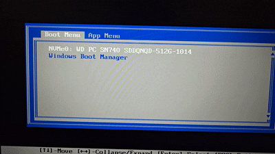

## The Situation
So I wanted to rebuild my homelab with the new equipment, but I have one big issue that I need to tackle before I can do that. The place that I am staying at doesn't have an ethernet port for me to use. I am forced to use Wi-Fi in order to be able to access the internet. That wouldn't be that big of an issue (other then the latency and reliability issues), except for two thing. The first one being that most server software doesn't come with Wi-Fi drivers out of the box. That wouldn't be that big of an issue, as I can manually download the package and install them. The second reason is that the place I am staying at is using an enterprise network (WPA2-EAP), which means that I would have to provide it my username and password in order to be able to connect to it. One of those issues wouldn't be that bad alone, but having two of them would be even more of an issue.

The solution? Having a router that is able to connect to the Wi-Fi that the other servers can plug into. Not only it's one device that I have to connect one device to the network, but it also allows me to easily change at one spot, instead of having to do it at each device. Having a router will also allow me to setup firewalls on the network.

## The Device
So what device I am going to use as the router? That will be the Acer Aspire 3 15 laptop that I have lying around. The laptop has an AMD Ryzen 5 7520U 2.8GHz processor, 8GB of RAM, and a 512GB solid-state drive.<sup>[1]</sup> All of this is 100% overkill for a router. Most consumers router probably have 1% of the specs in this laptop.


*The Image of the laptop.<sup>[1]</sup>*

## The Router OS
Now it's time to decide what router OS to go with. For the DIY routers market, there are 3 OSes (that I know of) to pick from. [pfSense](https://www.pfsense.org/), [OPNsense](https://opnsense.org/), and [OpenWrt](https://opnwrt.org). pfSense is a open source firewall/router that's built on top of FreeBSD.<sup>[2]</sup> It has been around since 2004, making it one of the oldest options in the list.<sup>[2]</sup>  However, I can immediately rule out pfSense, since they require an internet connection to be able to install the OS.<sup>[3]</sup> That is not possible for me, as I would need to configure the OS to be able to connect to the Wi-Fi here.

The next option is OPNsense. It is a fork of pfSense that was created in 2015.<sup>[4]</sup> Their reason for forking is because of the technical, security, and quality issues of the code base.<sup>[5]</sup> Not only that, but they also felt that the forked was necessary because Netgate, the parent company behind pfSense, has became less open with their community.<sup>[5]</sup> From hiding their build tools without warning to changing their licenses several times, made people distrust pfSense.<sup>[5]</sup> Despite all of that, I don't believe that OPNsense will work for me here. The reason why is that from what I've seen, FreeBSD's Wi-Fi support is still a hit or a miss for the cards.<sup>[6]</sup> And even if the Wi-Fi driver does support my Wi-Fi card, it might be lacking in Wi-Fi speed and features.<sup>[6]</sup>

That leaves us with the final option, OpenWrt. Unlike the other two, OpenWrt is an original project that's built on top of the Linux kernel.<sup>[7]</sup> It is also another open source project that was made in 2004.<sup>[7]</sup> It is designed to be run embedded devices, like an existing router, but can still run on x86 hardware.<sup>[7]</sup> But because of that, OpenWrt is designed to be extremely small enough to fit in the limit storage and ram that embedded devices have.<sup>[7]</sup> Since the laptop is currently running Arch Linux ~~(I use Arch, btw)~~, I know for sure that OpenWrt should work with that laptop. Not only that, but it's the only OS on the list that I haven't messed with before, so it will be fun learning how it operates.

## Downloading OpenWRT
With the OS picked, I went to [OpenWrt's download page](https://downloads.openwrt.org/). After selecting the latest version, I immediately get hit with a while bunch of options. 


*OpenWrt's download options for the latest version (25.12.5).*

Now most of these options are for embeded devices, so I can just ignore them. The one that I am looking for is the `x86` option. After clicking on that, I had to specify that I want the `64` version. Then I got taken to the images that are available for the router. 


*The download options for the x86 family.*


*The images available for the x86_64 version.*

I am confused on which one to pick. Since I know I am suppose to download an image, I can rule out the non `img.gz` files. That leaves me with 6 images, with 3 of them using `ext4`, and `squashfs`. I know what `ext4` is, since most linux distros use it, but I have never heard of `squashfs` before. After a quick search, I saw that it is a read-only file system.<sup>[8]</sup> Since I know that I have to modify the file system to install packages needed for the Wi-Fi card to work. That leaves me with three options for the `ext4` version. Since the `combined` version is bigger then the `rootfs` version, I assumed that it comes with more stuff. Finally, I went with the non `efi` version because I don't remember if the motherboard supports UEFI. 

## Installing OpenWrt
I then extract the `.gz` file to obtain the `.img` file from it. Since I have a Ventoy USB stick, I put the `.img` file in there. After doing that, I plugged the USB stick into the laptop, and booted into the BIOS. From there, I moved the USB stick to be the first option in the list.


*The BIOS boot order with the Ventoy stick being first.*

After that, I selected OpenWrt from the boot options. However, I got an error message when it tried to boot up Ventoy.


*The Ventoy boot menu with OpenWrt being selected*


*The error message that I got from booting into ventoy.*


So I went to the website listed in the error message. The following is the snippet taken from the [Ventoy docs about OpenWrt](https://www.ventoy.net/en/doc_openwrt.html) to explain the error.


>Since some kernel modules required by Ventoy are not included in the OpenWrt IMG file at present.  
So it is necessary to download the `ventoy_openwrt.xz` and put it in the USB stick.  
This plugin actually packs the kernel module files on the OpenWrt official website.


So I installed the `ventoy_openwrt.xz` file, and extracted the xz file. Then I created a root folder inside the Ventoy USB stick called `ventoy`, and put the extracted file in there. From there, I tried again to boot into OpenWrt, but it gave me the same error. That's when I re-read the instructions, and realised that it told me to put the xz file in there, not the extracted version. After I learned how to read properly, I was able to boot into OpenWrt.


*The OpenWrt GRUB boot menu.*

From there, I was able to see the Linux kernel messages being spit out into the screen. But after a few seconds, OpenWrt will automatically reboot itself. To try and figure out what just happened there, I took a picture before it reboots.


*The kernel messages before the system reboots itself.*

From looking at the screenshot, I notice the following line: `/dev/ventoy2: Can't lookup blockdev`. This line is must be what's causing the kernel to panic and reboot itself. This is when I decided to bail on ventoy, since I don't know how many more errors ventoy will throw at me. 

## Properly Installing OpenWrt
I used Fedora Media Writer to flash the `.img` file to a 2nd USB stick that I have. It is the simplest tool, that I know of, that allows me to flash files without that much worry of destroying the wrong disk. *(I'm looking at you, `dd`)*


*Flashing the `.img` file using Fedora Media Writer.*

From there, I plugged it into my laptop, and went into the BIOS. However, I don't see the USB Stick as a boot option. I don't know why it isn't showing up, until I read the first line in the BIOS menu.


*The USB stick not showing up in the boot menu.*

`Boot Mode: [UEFI]`. That will explain it. The "BIOS" is actually in UEFI mode. I have no idea what's going on with my brain, as being able to read properly will solve the simplest tasks here. Although, for this one, I can at least excuse myself by saying that the UEFI menu reminds me of a BIOS screen, and not the UEFI menu's that I've seen before. But after reflashing with the `efi` version, The USB stick popup in the boot menu. 


*The USB stick showing up after I flashed the right image to it.*


With the proper image, and actually flashing the image, I was able watch the kernel boot farther then before. However, after a few seconds of watching a whole bunch of random text fly across the screen. It randomly stopped. At first, I thought it was taking a second to load the next part. However, it shouldn't take a few minutes for the kernel to boot up, episcally for a router OS designed for weaker devices. That's when I notice the following line: `Please press Enter to activate this console.` And sure enough, pressing enter makes the shell prompt appear.


*OpenWrt fully loaded, and the shell has appeared.*

I really need to get my brain checked with how badly I am unable to read properly. It also doesn't help that I have no idea what I am doing here. I assumed that there will be a TUI (Terminal User Interface), or a command to run, that will popup to be able to install OpenWrt with. This is when my brain finally turned on, and decided to go to the [OpenWrt guide page](https://openwrt.org/docs/guide-user/installation/openwrt_x86) on how to install OpenWrt on x86 devices. 

That's when I learned that the **`.img` file is the OS, not the installer for the OS.** So when I flashed the `.img` file to the USB drive, I had actually installed OpenWrt to the USB drive.  I would need use a different method to install OpenWrt. Luckily for me, the guide show a way without removing the drive from the laptop. The method is basically using a live Linux environment on the USB drive to install the `.img` file, and run `dd` to flash it onto the disk inside the laptop.

## Properly Properly installing OpenWrt
While the guide does recommend only using one USB stick, it would be easier for me to use two different USB stick. The reason why is that A), I already have everything installed. And B) I don't feel like reconnecting the laptop to this place's Wi-Fi just for one download, especially since I am going to be using the Arch Linux live environment ~~(I use Arch, btw)~~. The reason why Arch is because that's the lightest distro I have already installed onto the drive. 

So after re-formatting the non Ventoy drive into FAT32, I copied the `.img` file to it. Then I plugged them both into the laptop, and booted into Arch linux. From there, I mounted the USB stick with the `.img` file, and copied it off the drive. Finally, I ran `dd` to flash the `.img` file to the internal storage of the laptop.


*The process of flashing OpenWrt into the internal storage of the laptop from the Arch Linux ~~(I use Arch, btw)~~ live environment.*

After a quick reboot, I was booted into OpenWrt  from the internal storage device, not from the USB sticks.


*Successfully booted into OpenWrt without any USB sticks plugged in.*

From there, I set the root password, since it comes without one. Since I don't want to fully control the router from the terminal, I would need to access it's web UI. So I grabbed a ethernet cable to plug into the lap-

**The laptop has no ethernet ports.**

How the absolute ever living **#\*@$** hell did I not even notice this till now?! I swear that my brain has been replaced with a pile of rocks, since there's no other reason for why I am making this much basic mistakes.

## The "Surgery"
Luckily for me, I do have another laptop I can use. The Lenovo ThinkPad P52s - 20LB0026US. Not only does it have i7-8550U CPU, 16GB of RAM, and 512 GB of storage.<sup>[9]</sup> Or, at least it's suppose to have 512GB of storage. But the previous owner of the laptop took it out before giving it to me. BTW, if you want free stuff, just ask people you know for their old junk. It's better to go into your hands then into the trash can.


*The Lenovo ThinkPad P52s - 20LB0026US laptop.*

However, since the Acer laptop can no longer be a router, I can take the storage off of it, and insert it into the ThinkPad. That is assuming that the Acer laptop didn't solder the storage. To confirm that, I would have to take apart the Acer laptop. So I started to unscrew the screws on the back of the laptop. After that, I took the [IFixIt "Jimmy" knife](https://www.ifixit.com/products/jimmy) to pry open the back case off the laptop.


*The Acer laptop with the internal components exposed.*

From there, I was able to confirm that the NVME drive isn't soldered. From there, I unscrew the drive off the laptop. 


*The NVME drive of the Acer laptop.*


*The NVME drive taken off the laptop, and sitting on the desk.*

Now I would just need to take the back cover off the ThinkPad, after I disconnect the external battery from it.
Something nice about the screws in the ThinkPad is that the screws can't fall of the laptop. So when you fully unscrew them, they will just hang around at the tip of the case, making them very shaky and lose. I like this because it means that I don't have to worry about accidentally losing the a screw.  But after unscrewing all of them, I took the "Jimmy" knife and pry the back case off the laptop. 


*The internals of the ThinkPad exposed.*

Question, where is the Storage slot? I can't easily find it from examining the bird's eye view of the laptop. That's because the NVME slot was hiding under the  big block of metal in the bottom left of the image. Why is it under there? I'm assuming that Leveno used to put 2.5" SSDs in that spot in a older model. However, when they made the new model, they reused the same size components as the older model, just with newer parts. So when it came to the storage, they reused the component for the SSD drive, and put in a NVME adaptor in there.  But anyway, I plugged the NMVE into that slot, and screw it down.


*The location of the NVME slot.*


*The Acer's NVME drive plugged into the ThinkPad.*

Since I am already inside the laptop, I took out the 2nd battery that is inside the laptop. I don't want the router to swoll any of the batteries, so it will be running from the wall only. 


*The internal battery taken out of the laptop.*

From there, I put everything back together, and booted up the laptop. I then went into the laptop's UEFI and checked if the NVME drive is being detected. Sure enough, it was. So I put it on top of the list. From there, I save and reboot the laptop. However, it won't boot into OpenWrt. Instead, it took me to the boot menu options list. I selected the NVME drive, but the screen will just flash black as it takes me back to the menu.


*The NVME drive failing to boot on the ThinkPad.*

I then spent about half an hour trying to figure out why it failed to boot, including reinstalling OpenWrt on the ThinkPad. The solution was to disable Secure Boot.  I did try that first, but it didn't do anything. Turns out, even though I set secure boot to be disabled when I save and exit the UEFI, it actually doesn't get disabled. it only get's disabled when I wipe the secure boot keys in the UEFI. Why is it like that? I have no idea.

But from there, I was able to plug the ThinkPad, and my machine, into the same switch. Then I went to `https://192.168.1.1` to be able to access the Web UI.<sup>[10]</sup> From there, it asked me for a login info for root. 


*The login page for OpenWrt's Web UI.*

Since one of my troubleshooting steps was to reinstall OpenWrt, the previous root password I set was gone. So I was confused on why it is asking for a root password, when there isn't one set. I put in a random password to see what happens, and it let me in.  Then it asked me for if I want OpenWrt to automatically check for firmware updates, which I said yes to. It also told me that there is no root password set. So I guess the "login" page will let you into the root account with any password, until you manually set the root password. So I set one.

## Wi-Fi Problems
Without having a plan on how to connect OpenWrt to this place's Wi-Fi, I went to the `network` -> `interface` section of OpenWrt. From there, I can only see the LAN interface from the ethernet cable. So I assumed that I will have to create a new interface for the Wi-FI card inside the laptop. I click on the button for creating a new interface. However, I wasn't able to select the Wi-Fi card as the device for the new interface to use. 


*The current interfaces in OpenWrt.*


*The Wi-Fi card missing from the devices drop down list.*

Turns out that all of the wireless logic goes under `network` -> `wireless`. However, the wireless tab is missing for me. Turns out, the tab doesn't appear if OpenWrt can't detect any wireless devices in the system.<sup>[11]</sup>  Since there is a wireless device in the laptop, that must mean that OpenWrt is missing drivers for the wireless chip. Now I know that the Wi-Fi chip works under Linux, but the question is which Linux kernel version does it support? 

I ran `uname -r` in the OpenWrt terminal to see what kernel version OpenWrt is using, and I got `6.12.94`. I then grabbed the oldest Linux distro I have already installed, which is Ubuntu 22.04, and boot it up into the laptop. Ubuntu 22.04 was not only able to use the Wi-Fi chip without any issue, but also was running kernel `6.8.0`.


*The live environment of Ubuntu 22.04 using the Wireless chip just fine with the kernel `6.8.0`.*

Since Ubuntu 22.04 was able to just the chip just fine with a older kernel version then OpenWrt, it mean's that the driver isn't bundle inside the Linux kernel.  And since the laptop has no internet connection, that means that I would have to manually install the packages. To do that, I would need to know where the packages are stored at. I can just run `cat /etc/apk/repositories.d/distfeeds.list` to get the list of the repoistories that apk, the package manager for OpwnWrt, uses.<sup>[12]</sup>

```bash
cat /etc/apk/repositories.d/distfeeds.list
https://downloads.openwrt.org/releases/25.12.5/targets/x86/64/packages/packages.adb
https://downloads.openwrt.org/releases/25.12.5/packages/x86_64/base/packages.adb
https://downloads.openwrt.org/releases/25.12.5/targets/x86/64/kmods/6.12.94-1-a7bc15f451f9652701ba04af9cfb0b95/packages.adb
https://downloads.openwrt.org/releases/25.12.5/packages/x86_64/luci/packages.adb
https://downloads.openwrt.org/releases/25.12.5/packages/x86_64/packages/packages.adb
https://downloads.openwrt.org/releases/25.12.5/packages/x86_64/routing/packages.adb
https://downloads.openwrt.org/releases/25.12.5/packages/x86_64/telephony/packages.adb
https://downloads.openwrt.org/releases/25.12.5/packages/x86_64/video/packages.adb
```


Now that I know where to manually get the packages, I would know need to know *what packages to install.* But to be able to do that, I would need to know which what type of wireless chip is inside the ThinkPad. Since I am feeling too lazy to reopen the laptop up, I would have to find out using the `lshw` command. Of course, OpenWrt doesn't come with that command. So I booted Fedora 44 onto the ThinkPad, connect to the Wi-Fi on there, installed `lshw`, and ran `lshw -c network` to get a list of network devices.


*The output of `lshw -c network`, which shows me the product and vendor info.*

From that command, I can see that the Wi-Fi card is from Intel, and the card is a 8265/8275. At first, I thought searching up both `intel wireless 8265` and `intel wireless 8275` will show me two different cards. But they both link to the `Intel® Dual Band Wireless-AC 8265` card. Going back to the package's url, I search for the `8265`, and found the `iwlwifi-firmware-iwl8265-20260221-r1.apk` package. So I grabbed that, and the `intel-microcode-20251111-r1.apk` package.

I then copied those files over to the USB stick, plugged it into the OpenWrt Laptop, mount the USB, and ran `apk add *.apk` on those files. However, the first issue that I ran into was that apk complained about the signature not being trusted on the package. I just had to tell apk to allow untrusted packages with the `--alow-untrusted`.<sup>[13]</sup> 

The next issue was that the package wouldn't install because it was missing dependencies. Luckly, it did tell me what dependencies I was missing. But it only told me the missing dependencies for the current package, not the dependencies for the dependencies. So I spent the next hour manually downloading the dependencies from the website, put it to the USB stick, plugged it into the laptop, installed the downloaded dependencies, get the new list of dependencies, and repeat the cycles after everything is installed. But this is the list of packages that I needed to install:
- `hostapd-common-2025.08.26~ca266cc2-r1.apk`
- `intel-microcode-20251111-r1.apk`  (Inital packages)
- `iw-full-6.17-r1.apk` (Inital packages)
- `iwlwifi-firmware-iwl8265-20260221-r1.apk` (Inital packages)
- `kmod-cfg80211-6.12.94.6.18.26-r1.apk`
- `kmod-crypto-aead-6.12.94-r1.apk`
- `kmod-crypto-ccm-6.12.94-r1.apk`
- `kmod-crypto-cmac-6.12.94-r1.apk`
- `kmod-crypto-ctr-6.12.94-r1.apk`
- `kmod-crypto-gcm-6.12.94-r1.apk`
- `kmod-crypto-geniv-6.12.94-r1.apk`
- `kmod-crypto-gf128-6.12.94-r1.apk`
- `kmod-crypto-ghash-6.12.94-r1.apk`
- `kmod-crypto-hmac-6.12.94-r1.apk`
- `kmod-crypto-manager-6.12.94-r1.apk`
- `kmod-crypto-null-6.12.94-r1.apk`
- `kmod-crypto-rng-6.12.94-r1.apk`
- `kmod-crypto-seqiv-6.12.94-r1.apk`
- `kmod-crypto-sha3-6.12.94-r1.apk`
- `kmod-crypto-sha512-6.12.94-r1.apk`
- `kmod-iwlwifi-6.12.94.6.18.26-r1.apk`
- `kmod-mac80211-6.12.94.6.18.26-r1.apk`
- `ucode-mod-digest-2026.01.16~85922056-r1.apk`
- `ucode-mod-nl80211-2026.01.16~85922056-r1.apk`
- `ucode-mod-rtnl-2026.01.16~85922056-r1.apk`
- `wifi-scripts-1.0-r1.apk`
- `wireless-regdb-2026.05.30-r1.apk`

*It also took me until I am writing the blog post that I remember that I could have used `SCP` to copied the packages over.*

But after installing all of the package, I rebooted OpenWrt to ensure that it used the newly installed packages. And sure enough, the wireless tab now appears.


*The wireless tab now appearing after installing the drivers.*

## Connecting to the Wi-Fi Shouldn't Be that Hard, Right?

After installing the Wi-Fi drivers, I headed towards the Wireless section of OpenWrt. From there, I clicked on the scan button to look for the nearest AP at this place.


*The current wireless overview with the mouse hovering over the scan button.*


*The wireless chip was able to detect the APs nearest to me.*

The problem is that I see multiple options for the same network. I believe that OpenWrt isn't combing multiple APs into one option, allowing me to pick the best AP for my needs. The problem with that approach is that I don't know the best AP for me.  

The first thing that I looked at is the signal. I don't know what's the actual difference between those numbers, nor why they're all in the negatives. A quick search online tells me that the number means how strong the connection is, and higher numbers are better then lower numbers (-60DBm > -79DBm).<sup>[14]</sup>

The next thing to try to understand is the channel. After spending some time, I stumbled across the [Wikipedia article](https://en.wikipedia.org/wiki/List_of_WLAN_channels) that shows what the channels actually means. basically, the channel numbers shows what frequency the wireless signal is being sent at.<sup>[15]</sup> So for example, the number 6 channel is operating at a frequency range of from 2426 to 2448.<sup>[15]</sup> It also shows that any channel from 1 to 14 is in the 2.4Ghz range, while channels from 120 to 177 are in the 5GHz.<sup>[15]</sup>   


*The channel frequency ranges for 2.4GHz.<sup>[15]</sup>*


*The channel frequency ranges for 5GHz.<sup>[15]</sup>*

So from that research, I picked the AP that where it's signal is at -62DBm, and operating at the 161 channel. However, I quickly realised that it was kinda pointless to pick a specific AP, as the next page asked me if I want to stay locked down to one AP only. And by default, the option is set to no. 


*The option of being locked down to only one AP, with the default option being set to no.*

After that, I went to the next page. However, I got overwhelmed on the amount of options, so I left them as default.


*The wireless network options page.*

However, after I went pasted that confusing page, it took me back to the overview page. The problem with that is that it never asked me for the Wi-Fi password. I went back to the wireless network options page, and found out that the reason why it never asked me for the password is that it's missing the package (`wpa_supplicant`) to support Wi-Fi encryption. So after quickly manually installing the package, and rebooting OpenWrt, I am now able to select the Wi-Fi Encryption.


*OpenWrt telling me that I am missing the package needed to install wpa_supplicant.*


*OpenWrt now letting me pick a Wi-Fi encryption option.*

From there, I selected the `WPA2-EAP` encryption option, and filled out my network login info. I then click saved an applied the options. But as soon as I clicked apply, I saw the Laptop's screen spit out some information. I took a closer look at it, and realised that it was complaining that the connection failed with error `23=IEEE8201X_FAILED`.


*The kernel messages complaining about the failed connection attempted.*

At first, I thought it was because I didn't checked `Use system certificates`, since my other devices connected to the network is set to use that. But in order to do that, I have to install the `ca-bundle` & `ca-certificates` packages. But even after installing them, and rebooting, I still got the same error. So to enure that the connection settings is the exact same as the other devices, I set the EAP-method to `PEAP`, and the authentication to `EAP-MSCHAPv2`. Well, the authentication is suppose to be set to `MSCHAPv2`, but OpenWRT says that it isn't compatible with `MSCHAPv2`, so `EAP-MSCHAPv2` it is. But it doesn't matter, as it still throws out the same error.

Then I wanted to check if the issue is because of the laptop, or because of the enterprise network my place has setup here. So I created a hotpot on my phone with `WPA2-PSK` encryption, and made a new connection to it.  And OpenWRT is not only able to connect to my phone's hotspot, but is also able to ping `1.1.1.1`.


*OpenWRT is connected to my phone's hotspot.*


*OpenWrt being able to ping `1.1.1.1`.*

So this means that the issue is with OpenWRT not being able to properly connect to the enterprise network. So I spent an hour searching online to try and figure out why it isn't able to work. But I wasn't able to find anything useful there. So I then spent the next 6 hours using Claude to try to fix the error, and he manage to actually fix it. To save you (and me) the torture of explaining everything that happened in that time frame, I will just have Claude explain what the actual error was, and the fix:

> When connecting to the WPA2-Enterprise network, OpenWRT would associate with the access point just fine, but then immediately get kicked with an "IEEE8021X_FAILED" error. The real cause turned out to be a bug in the tool that generates the Wi-Fi connection settings behind the scenes. This network uses PEAP with an inner authentication method called MSCHAPv2, and the settings file needs to specify that inner method using its exact name — just "MSCHAPV2." Instead, the tool was writing it as "EAP-MSCHAPV2," carrying over an extra prefix from the dropdown menu in the settings page, without stripping it off first like it was supposed to.
> 
> The software actually handling the connection only understands the bare name "MSCHAPV2" — it doesn't recognize "EAP-MSCHAPV2" as a valid method, so it failed to set up that part of the login process and dropped the connection every time, even though the username and password were completely correct.
> 
> The fix was to manually set the authentication method directly to the bare name, skipping over the buggy step entirely:
> 
> ```
> uci set wireless.@wifi-iface[1].auth='MSCHAPV2'
> uci commit wireless
> wifi reload
> ```
> 
> (Adjust `@wifi-iface[1]` to match the actual index of your STA interface — check with `uci show wireless | grep auth` first if unsure.)

So this entire problem was that OpenWrt gaslight me into thinking that `PEAP` doesn't work with `MSCHAPv2`, dispute those two working together on other devices. So I had to force OpenWrt to use `MSCHAPv2`. The only problem with that is that I would have to rerun those commands every-time I make a change in the Web UI, as OpenWrt still tries to gaslight me and won't let me save until I change `MSCHAPv2` to `EAP-MSCHAPv2`. 


*OpenWrt sucessfully being able to connect to the enterprise network.*


*The error preventing me from making any changes from the Web UI.*

## Setting up A Custom AP
The next thing I wanted to do is setup a custom AP to allow my phone to access the network. To do this, I would create a new wireless network, set it to be an Access Point (AP), assigned it a name, and attach it to the LAN interface. Then I would make it use the `WPA2-PSK` encryption, and set the password for it *(definitely did not set the password to 12345678)*.


*The general setup for the new wireless network to be set to an AP.*


*The encryption and password info set for the new AP.*

Then, after saving it and enabling it. I was able to see the custom AP my phone. I then tried to connect to it, but I notice that my phone said that it was connect to the AP, but it doesn't have any internet connection. That's when I notice that OpenWrt has automatically disconnected from this place's Wi-Fi.


*The custom AP appearing on my phone.*


*My phone complaining that the custom AP doesn't have any internet connection.*


*OpenWrt no longer connected to the place's Wi-Fi.*

At first, I thought that OpenWrt has automatically disconnected after some time has passed. So I disable the custom AP, and rebooted the laptop. Then I left it on idle for about an hour. After that time passed, the connection was still standing strong. But right after I turn on the custom AP, OpenWrt has lost connection to this place's Wi-Fi. Meaning that the custom AP is causing the internet connection to be lost. With Claude ability to be able to fix the earlier problem, I went back to him to try and fix this problem. So I will have Claude basically explain the issues after a few hours spent trying to troubleshoot it. 

> Trying to run both a connection to the building's Wi-Fi and the laptop's own hosted Wi-Fi network at the same time never worked reliably. The root cause was that the laptop only has one physical Wi-Fi radio, and both roles — connecting out to the building's network and broadcasting its own network for other devices to join — had to share that single radio. One immediate symptom of this was that the hosted network would only show up at all when set to broadcast on 2.4GHz; setting it to 5GHz caused it to silently refuse to turn on, since many 5GHz channels require special radar-detection compliance that only applies to networks being broadcast, not to networks being connected to as a client.
>
> Beyond that, since a radio can only sit on one Wi-Fi channel at a time, turning on the hosted network forced the whole radio to reconfigure, including switching frequency bands, which knocked the already-working connection to the building's network off its channel entirely. That connection would then fail to reconnect at all, and only a full reboot of the laptop would restore it, even after the hosted network was turned back off.
>
> Several workarounds were attempted, but none held up. Manually locking both networks to the same fixed Wi-Fi channel seemed like the obvious fix, but the setting responsible for that only applied to the network being broadcast, not the one being connected to — so the outgoing connection kept freely roaming between different access points on different channels regardless of what was configured. Pinning the outgoing connection to one specific access point instead of letting it roam was tried as well, but it still didn't fully resolve the conflict, and the two roles continued interfering with each other every time both were active.

So I would need a separate device to be the AP, but I will leave that problem to future me.

## Testing the Router in Action
So the last thing I would need to do is test how the laptop router will preform in the field. The first thing I wanted to see is if OpenWrt will go to sleep if I close the lid. So what I did is that I ssh into the laptop, and made it ping `1.1.1.1`. Once it started to ping, I then closed the lid and watch the ping results. It was still pinging after the lid was closed. But I wasn't satisfy with this, since I don't know the internal timer for how long to wait until it goes to sleep. So I left it running like this for about an hour. When I came back I saw that not only the ssh connection was still alive, but it was able to ping jut fine. I examine the ping history, and saw that it never dropped a ping during that session. This ensured me that the laptop was able to work with the lid closed.

The next thing I wanted to test is if a brand new device is able to connect to the internet just from plugging in the Ethernet cable. Since I don't have another device lying around, I decided that booting my device into a live Linux environment would do the job. So after booting into CachyOS, I pulled up the terminal and ping `1.1.1.1` and `google.com`. And both of them were able to be pinged just fine. So new devices won't have any issues getting setup here.


*The pings working just fine here.*

The last thing that I wanted to test was the speed difference using the laptop, and just going straight to this place's Wi-Fi. To do the speed test, I went to https://fast.com/. And the speed difference were so close to each other, that they can fall into the margin of error.   


*The speed test that I did while being connected to Wi-Fi only.*


*The speed test that I did while being connected to the laptop.*

The thing is, I accidentally did one more test. When I was messing around with the connection on my machine earlier, I forgotten that I accidentally disabled my Wi-Fi. So I've spent around 5 hours using the laptop as my router, and I didn't even notice a difference.  So this shows how well the laptop router is doing it's job. 

## SSH Setup
The last thing I need to do is setup SSH Keys for the laptop to make it more secure. To create the key, I ran `ssh-keygen -t ed25519 -f ~/.ssh/OpenWrt` on my device. Then I ran `cat ~/.ssh/OpenWrt.pub` to get the public key, and copied it to my clipboard. 

Then I went to `System -> Administration` to access the admin settings. From there, I went to the `SSH-Keys` tab. Using the contents of `OpenWrt.pub` that is in the clipboard, I pasted it into the text box for adding a public SSH key. I then click `Add Key` to add the key.


*The text box to paste the content of a public SSH key.*

The next step that I did is that I went to the `SSH Access` tab. From there, I set the SSH port to `35478`. The reason why is that leaving the SSH port to port `22` is to make the bot scanners not see that SSH is on port 22, making them think that SSH isn't running on that machine.<sup>[16]</sup> Now of course, the laptop is not being exposed to the public internet, but it is still a good habit to have. The new port number was picked because I just pressed random keys on my keyboard.

Of course that is not enough, as the bots can just scan all of the ports on the machine, making them find the actual port that SSH is on. That is why I also disable `password authentication`. This disable the ability to use SSH with the user's password, which help prevent brute force attacks.<sup>[17]</sup> The last thing that I did is set SSH to only allow connections coming from the LAN port. After that , I saved and applied the changes.


Now the last thing that I did is setup the `~/.ssh/config` file. What this file does is that it saves the ssh configuration as the hostname.<sup>[18]</sup> So I put in the following into the file.

```ssh-config
Host OpenWrt
	HostName 192.168.1.1
	user root
	IdentityFile ~/.ssh/OpenWrt
	Port 35478
```

Now I can run `ssh OpenWrt`, and I can securly SSH without worrying about the config.


*The SSH config file in action, allowing me to SSH to OpenWrt with a simple command.*

## Citations
> [1] Consumer Reports. “Acer Aspire 3 A315-24PT-R90Z Laptop & Chromebook Review - Consumer Reports.” _Consumer Reports_, 2018, www.consumerreports.org/electronics-computers/laptops-chromebooks/acer-aspire-3-a315-24pt-r90z/m409065/. Accessed 3 July 2026.
> [2] Wikipedia Contributors. “PfSense.” _Wikipedia_, 18 Feb. 2021, en.wikipedia.org/wiki/PfSense. Accessed 3 July 2026.
> [3] Netgate Docs. “Perform the Installation | PfSense Documentation.” _Netgate.com_, 2026, docs.netgate.com/pfsense/en/latest/install/install-pfsense.html#prerequisites. Accessed 3 July 2026.
> [4] Wikipedia Contributors. “OPNsense.” _Wikipedia_, Wikimedia Foundation, 27 Sept. 2024, en.wikipedia.org/wiki/OPNsense. Accessed 3 July 2026.
> [5] OPNsense Docs. “About the Fork — OPNsense Documentation.” _Docs.opnsense.org_, docs.opnsense.org/history/thefork.html. Accessed 3 July 2026.
> [6] toasty_fe. “WiFi Support on FreeBSD 14 .” _Reddit.com_, 22 Nov. 2023, www.reddit.com/r/freebsd/comments/1819ywu/wifi_support_on_freebsd_14/. Accessed 3 July 2026.
> [7] Wikipedia Contributors. “OpenWrt.” _Wikipedia_, 4 July 2020, en.wikipedia.org/wiki/OpenWrt. Accessed 3 July 2026.
> [8] Wikipedia Contributors. “SquashFS.” _Wikipedia_, Wikimedia Foundation, 23 Apr. 2025, en.wikipedia.org/wiki/SquashFS. Accessed 3 July 2026.
> [9] Laptop Arena. “Lenovo ThinkPad P52s - 20LB0026US Laptop Specifications.” _Laptoparena.net_, 2018, www.laptoparena.net/lenovo/mobile-workstation-lenovo-thinkpad-p52s-20lb0026us-black-4202. Accessed 4 July 2026.
> [10] OpenWrt Wiki Contributors. “[OpenWrt Wiki] Log into Your Router Running OpenWrt.” _Openwrt.org_, 2021, openwrt.org/docs/guide-quick-start/walkthrough_login. Accessed 4 July 2026.
> [11] bwyer. “How to Enable WiFi on Openwrt? .” _Reddit.com_, 2 Nov. 2019, www.reddit.com/r/openwrt/comments/dqjajo/Pcomment/f683mcy/. Accessed 4 July 2026.
> [12] OpenWrt Wiki Contributors. “[OpenWrt Wiki] Apk Package Manager.” _Openwrt.org_, 2026, openwrt.org/docs/guide-user/additional-software/apk#repository_feeds. Accessed 4 July 2026.
> [13] Alpine Wiki Contributors. “Alpine Package Keeper - Alpine Linux.” _Alpinelinux.org_, 2022, wiki.alpinelinux.org/wiki/Alpine_Package_Keeper. Accessed 4 July 2026.
> [14] TheEthyr. “How to Understand OpenWRT Codes and Numbers .” _Reddit.com_, 13 May 2021, www.reddit.com/r/HomeNetworking/comments/nbjhgh/comment/gxzs8dp/. Accessed 4 July 2026.
> [15] Wikipedia Contributors. “List of WLAN Channels.” _Wikipedia_, Wikimedia Foundation, 24 Oct. 2019, en.wikipedia.org/wiki/List_of_WLAN_channels. Accessed 4 July 2026.
> [16] Scott Pack. (2013, March 9). _Should I change the default SSH port on linux servers?_ Information Security Stack Exchange. https://security.stackexchange.com/a/32311
> [17] ctz. (2026, April 17). _Here’s why you should disable SSH password login on every VPS_. Medium. https://medium.com/@ctzisme/heres-why-you-should-disable-ssh-password-login-on-every-vps-7b083d659a7f
> [18] Teleport. “SSH Client Config Files and How to Use Them.” GoTeleport, 6 Jan. 2022. https://goteleport.com/blog/ssh-client-config-file-example/