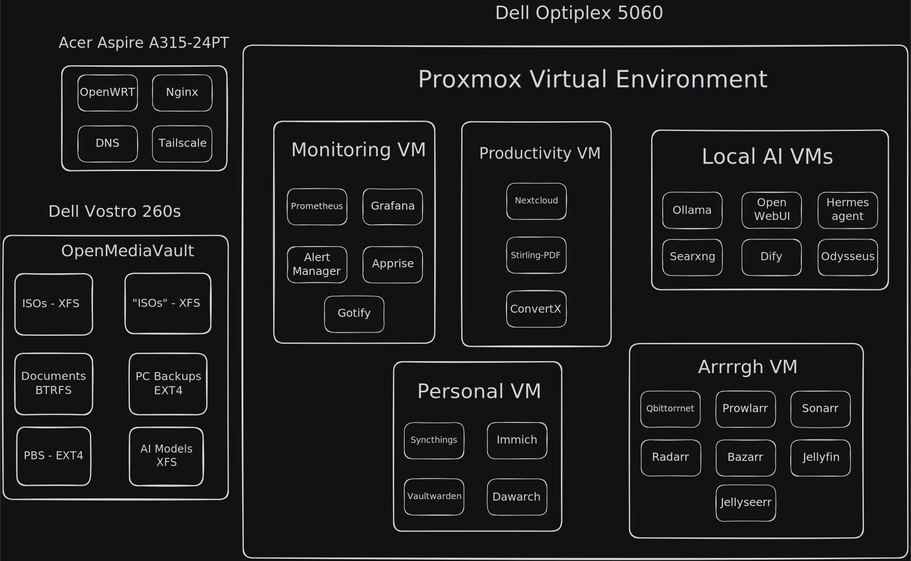
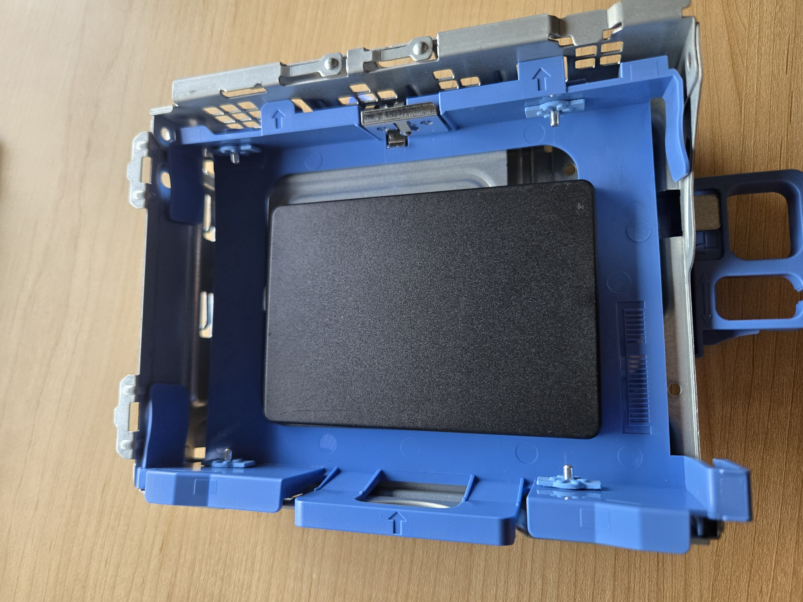
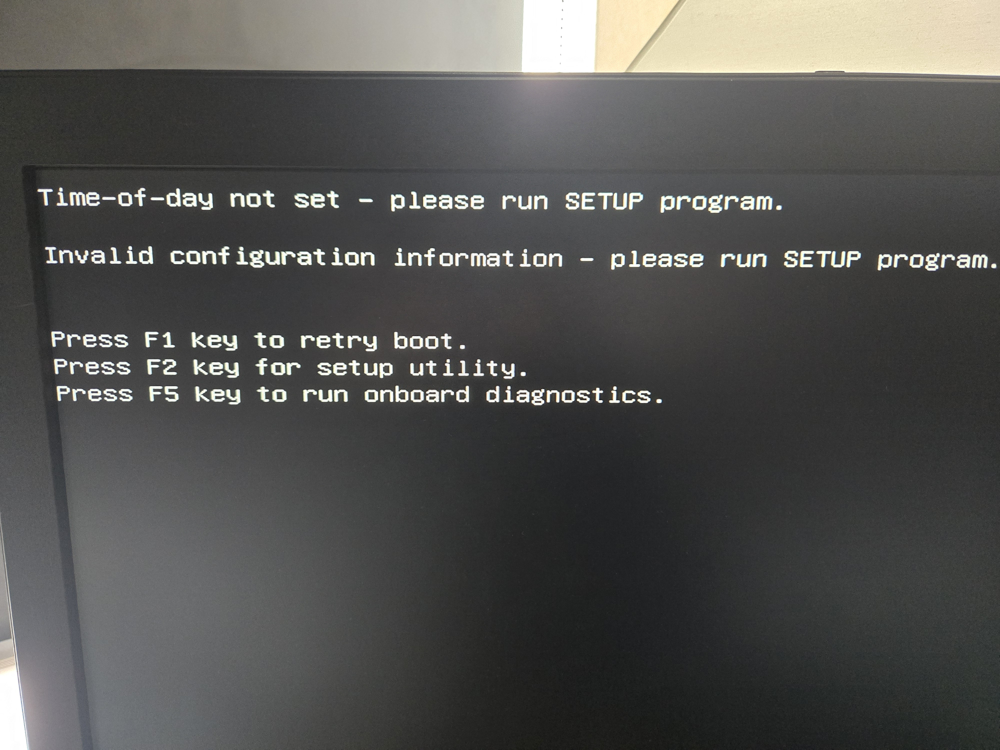

## The Plan
So I have recently heard that my college was giving away old and retired PCs for free. At first, I didn't believe this. But after talking to the head IT guy, he told me that the school isn't allow to sell or recycle the PCs for a certain period of time. And since the PCs are sitting the tech "graveyard", he decided to let students take them away for free. So after looking around the "graveyard", I took away two PCs. A Dell Optiplex 5060, and a Dell Vostro 260s.

*THe Dell Optiplex 5060 and the Dell Vostro 260s standing next to each other.*

The reason for grabbing two PCs is that the Optiplex PC has a better processor, and support DDR4 RAM. But it has a proprietary motherboard, preventing me from taking it out of that case. So this PC will be mainly used as a Proxmox hypervisor for the homelab.

The Vostro PC is an much older PC that supports only DDR3 RAM. But the motherboard is a normal ATX board, allowing me to take it out. The reason why I care about that is that I can put the motherboard into a bigger case to be able to insert more mechanical hard drives into it. So for this reason, the Vostro will be the NAS for the homelab. 

After deciding that, I then sketch a diagram of what I plan to put in the homelab. Note that the diagram also includes the [[Turning an Old Laptop into a Router|router laptop]] that I already done the basic setup with it. 

*The services layout diagram for the homelab.*

Also this isn't the final version of the homelab, but just the services I will want to mess with as of this moment. I also won't go into too much detail for the individual services now, but I will once I get into them. But what I will quickly explain is the grouping of the services into one VMs. The reason why is to make it easy to make it easy for the services to talk to each other, and to quickly turn them on/off when needed for management.

## The Optiplex unboxing
The dell one was the one I was more inserted in setting up first, so I opened that baby right up.

*The dell Optiplex 5060 opened.*

The first thing that I notice is the big hard drive taking up 1/4 of the PC. So I took it out to take a closer look at it. I notice that it is a Seagate 500GB drive. 

*The Seagate 500GB hard drive in the cage.*

I then took the hard drive out of the cage. My plan is to take the 2.5" SSD drive in the [[Turning an Old Laptop into a Proxmox Server|Laptop Proxmox Server]], which I stopped using because the laptop would randomly freeze on me, and insert it into the Optiplex. The only problem with that is that the SSD is too small to fit into the cage.

*The SSD being too small to fit into the cage.*

But I will deal with that later. I then moved on to the rest of the Optiplex. I went to go check the RAM specs of the machine. But that's when I notice that the machine is missing RAM sticks.

*The Optiplex PC having no RAM sticks in there.*

That's when I remember that the head IT guy told me that If the PC has any DDR4 RAM in there, or a SATA SSD or NVME SSD, then I would have to take it out before taking the machine. This is only the policy because of the current RAM apocalypse going on (Thanks Sam Altman).

So without any way of booting up the machine, I put all of the peices back in there, and put the machine away for now. When I get some used DDR4 RAM, then I would able to work on this machine. 
## The Vostro 260s Unboxing
After swapping the Optiplex machine with the Vostro machine, I open that baby up.

*The insides of the Dell Vostro 260s machine.*

Just like the Optiplex machine, The first thing that catched my eye is the hard drive. After taking it out for a closer look, I notice that it is the same hard drive that was found in the Optiplex machine (Seagate 500GB).

*The Seagate 500GB found in the Vostro machine.*

However, unlike the Optiplex, the Vostro came with RAM inside of it. The reason why is that the RAM stick are DDR3, which the head IT guy doesn't care if I take them. So after taking them apart for a closer look, I realised that they are both 4GB sticks. But they are two different brands, so hopefully mixing the RAM sticks doesn't cause any issues.

*The DDR3 RAM sticks found inside the Vostro 260s.*

From there, I worked on unplugging all of the cables from the motherboard. After I did that, I then unscrewed the motherboard's screws until I was able to take out the motherboard.

*The motherboard taken out of the Vostro 260s.*

## The Vostro's Transplant

With the Vostro's motherboard taken out, I can put into a better case. And what a better case means in this scenario is being able to hold multiple hard drive. If I wasn't planning on using it as a NAS, then the original case would have been good enough. But besides that, I was able to also take a case that the IT guy wasn't using. I have no idea what the exact model of the case is. Just that it is a Ciara tech case. 

*The Ciara case that I grabbed.*

Opening the case shows not only that there is a spot for the hard drive bays, but that I already installed a power supply into the case. And of course, I grabbed the power supply from the IT guy, and installed it over there.

*The power supply being pre-installed into the case. There is also a section in the bottom right of the case for the hard drive bays.*

Taking a closer look at the power supply shows that is a non modular, 80+, 400w power supply from Power Man. IT was a generic power supply that I grabbed from the used pile, so hopefully it doesn't blow up on me *(finger crossed)*. 

*The power supply that is installed into the case.*

I then screw the motherboard into the case. It wasn't that bad to get in in there, except for the fact that I forgot the IO shield. So I had to take out the motherboard, push the IO shield out of the Vostro, pushed it into the Ciara case, and reinstalled the motherboard.

*The motherboard being installed into the Ciara case.*

I then installed the RAM into the motherboard.

*The RAM installed into the motherboard.*

I then attempted to attached the hard drive into the case. But the problem is that the case is missing the sleds to hold the hard drives. Meaning that I can't (easily) attached the hard drive into the server. 

*The hard drives being unable to attached the PC case.*

Finally, the last thing I would need to do is attached the cables to the motherboard. So I started to plug the cables into their right spot. But then I hit a pretty big wall. The power supply cable for the CPU is unable to reach the socket plug on the motherboard. And since the CPU needs power for the computer to work, I would unable to continue without swapping out the power supply.

*The power supply CPU pin being stretched out to as far as it can go, which is about halfway through the motherboard.*

So for me to continue one with the hardware, I would need the following items: 
- the DDR4 RAM for the Dell Optiplex 5060
- A PC power supply where the CPU pin can reach the CPU socket at the very top of the case.
- Hard drive sleds to be able to hold the hard drive inside the case.

## Got some RAM
So some time has passed since the initial build. But in that time frame, I found a deal for some 2x8GB DDR4 2400MHz ECC RAM for about $60 bucks. This was the cheapest deal that I can find for used RAM on Ebay and Facebook Marketplace. Not only that, but it was also ECC RAM, which I have never used before. Now I have never messed with ECC RAM before. So when I saw that the cheapest DDR4 ram was ECC RAM, I took the bullet and bought the RAM.

*The 2 8GB ECC RAM sticks that I've obtained.*

So I then plugged it into the Dell Optiplex. Also it looks a bit weird that the RAM sticks has to chips on the back side, making the back of the RAM look "naked".

*The ECC DDR4 RAM installed into the Dell Optiplex. Notice how the back has no chips, making it look werid.*

But perverted ideas aside, I plug the power supply into the PC, and turned it on. That's when the PC yelled at me by beeping at me 3 times. I immediately recognised this as a BIOS error code, so something must be wrong with this PC. A quick online searched told me that the PC is having issues with the RAM.

At first, I thought that the Facebook Marketplace listing I bought said that it was broken RAM, and I missed that part. But going back to the list showed that he said that he took it out of a working server. SO then I thought that he lied about that, and that he sold me broken RAM. Now mind you that this is my first time using Facebook Marketplace, so I don't really have an exception of how transactions work on there. 

But as I was scrolling through my direct messages with the seller, he asked me if I knew that this was ECC RAM. When he sent that message at me first, I thought it was weird for him to emphasize that point. But now seeing that message while the PC beeps at me made me think that ECC RAM doesn't work on any CPU/Motherboard. And a quick online search has confirm that thought. So I just bought paperweight.

Luckily for me, I stumbled across a Facebook Marketplace listing where a guy was selling the exact same RAM kit, but without any ECC. Not only that, but I manage to trade my ECC RAM for his non-ECC RAM. 

*The 2 GB DDR4 2400MHz RAM kit that I traded my ECC RAM with.*

Plugging those RAM sticks into the PC caused it to not beep at me. But a new problem has appeared. I have no way to get the output of the PC. The thing is, the PC only had a Display Port, or a VGA output. My monitor only has a HDMI cable, preventing me from seeing the output of the PC.

Since I would only need to see the output to install Proxmox onto it, I would need to just borrow a adapter for a short time. So like the MVP the IT guys have been, I was able to borrow a adapter. But the only adapters that they had for Display Port was to DVI-D. As annoying that was, I was able to combine it with a DVI-D to HDMI adapter to fix it. 

*The adapter combine together to make the it work.*

And with that, the PC was able to be booted.

*The PC booting up properly.*

## Duct Tape > Screws
So now the only problem left with the Dell Optiplex is that I had no way to mount the SSD drive down. The current method is just leaving it flopping around in the case. And while SSD are less acceptable to vibrations, it still bother me that it just hanging in the case. Plus, any sudden movement to the case might cause the SSD to be forcefully plugged out of the cables, or collide with the other parts inside the case. 

So I bought some duct tape to tape the SSD down. I took the hard drive bay out of the PC to make it easier for me to tape it down. After putting tape on all corners of the SDD, I was able to keep it mounted down there. 

*The SSD being mounted down by duct tape.*

After that, I put the hard drive bay back into the PC, and plug in the Ventoy USB installer, and the Ethernet cable connected to the [[Turning an Old Laptop into a Router|laptop router]]. After that, I booted the PC into the Proxmox installer.

*The Proxmox installer on the Dell Optiplex PC.*

After that, I just installed it without anything going wrong. The only interesting about the installation process was deciding what file system to use. I can cross out ZFS and BTRFS, since the only options for them is in a RAID configuration, and I can't really do RAID with only one drive. Then the only options were XFS and EXT4. Since XFS is really only good on large files, I can cross that out since the VMs will be small. So that only leaves me with EXT4.

But after that, I was to install Proxmox, and access it through the Web UI.

*Being able to access the Proxmox Web UI.*

So now the Dell Optiplex is all setup to be used.

## Fixing the Dell Vostro PC.
So with in that time frame, I was also able to get a new power supply from the IT guy. This time is it a Antec, 850w, 80+ Bronze power supply. The CPU cable should be long enough to reach the top of the PC case. Not only that, but the power supply is semi modular, with the CPU and Motherboard cables being the only ones attached to it. So I can make the power supply only have the minimum amount of cables needed to make it less messy.

*The new PC power supply.*

Not only that, but I was also able to get a different motherboard that has 6 SATA ports built in, instead of the 4 from the Vostro. It also has 4 DDR3 RAM slots instead of the 2 from Vostro, and two of them are already populated with free RAM. Now they're only 2GB, but free RAM is free RAM.

*The new motherboard.*

At this point the Dell Vostro has became the ship of theseus PC. It is only the Dell Vostro in the name alone. 

I then started to unscrew the Vostro motherboard off the PC. However, I notice that one of the screws isn't being unscrew off properly. The screw was stuck in the able, but still being able to be spinned. I then realised that the corner that the screw was in was loose. So after pulling the motherboard off, I was able to see what the issue was. The screw was stuck in the motherboard standoff. So when I was "unscrewing" the screw, I was actually unscrewing the motherboard standoff.

*The motherboard standoff being stuck in the motherboard.*

I then took out the older power supply. And unlike the motherboard, I was able to successfully take it out taking pieces of the case with it. With those two pieces out, I was able to screw in motherboard, or at least 3/4 of it, and the power supply into the case. Finally, I was able to connect all of the cables, including the power supply CPU cable.

*The PC all setup with all of the pieces screw down and cables up.*

And with that, the NAS PC was finally able to be booted up.

*The NAS PC in the POST screen.*

Now the only thing left is to get the hard drive sleds for the NAS PC to be able to use it.
## The Hard Drive Sleds Problems
The first thing that I did was borrow some hard drive sleds form the school. Since I can't keep them, they will be just to help me see which size works with the case. The one I got from the school is the individual sliding pieces that can be attached to the hard drive itself. So I attached one to the drive for testing.

*The individual hard drive sled attached to the hard drive.*

However, this wouldn't work, as the sled kept popping off the case whenever I tried to slide it in. I even tried just sliding one piece to see if that works, but it didn't. I did forget to take a picture of this, and it's too late to retake it, as I already returned the sled back.

I then went looking online for a new sleds. I eventually settled on [these sleds from amazon.](https://www.amazon.ca/dp/B08B555F4M?ref=ppx_yo2ov_dt_b_fed_asin_title) However, just like the other sleds, they won't fit inside the case. 

From this, I came to the conclusion that the Ciara case must have used proprietary hard drive sleds, so I wouldn't be able to put hard drive into this case. However, what I should have come to a conclusion wayyy earlier then when I am writing this articles is that what I order is 2.5" to 3.5" adapters. But either way I returned the sleds. 

## New case to fix my issues.
So after doom scrolling on Facebook Marketplace for a while, I stumbled across a post where a guy was selling a old case for $5 bucks. I took a closer look, and I saw that the case had 4 hard drive slots, and a empty optical bay slot for more hard drive in the futures. So after a quick conversation with the seller, I am now the owner of that case.

*The $5 PC case that I got from Facebook Marketplace.*

The best part about the case is that it came with the sleds, so I don't have to worry about look for the right ones later on. 

*The hard drive sled.*

I did try to put those sleds into the Ciara case out of curiosity to see if they will fit. And the sled were too big to fit in there.  

*The $5 dollar case hard drive sled not fitting into the Ciara case.*

But after looking closely at the $5 case, I saw that the owner left a 2.5" SATA SSD in there. So I took it out to see what it is, and it is a Kingston SSDNow V+200 120GB. I see that 120GB SATA SSD are going around Facebook Marketplace for about $20 bucks, so that was good deal to find. I am just going to use this drive as the boot drive, since it doesn't need that much storage.

*The Kingston 120GB drive that was found in the $5 case.*

I then loaded in the rest of the hard drives into the case. However, I quickly ran into a problem. The case has no, visible, way for me to take the back case off, prevent me from being able to plug in the hard drives. I spent a good few minutes looking around the case, and messing with random things, to find a way. But the way doesn't exist.

So I went with a janky plan to get them plug in. The first thing that I would do is route all of the SATA data and power cables to the hard drive bays via a oval cutout. Then I would plug the data cable, and the very top of the power cable into the first hard drive only. Then I will put in the hard drive halfway into the bottom slot. The reason why I slide it half way is to allow me to reach the other cables in the back, while not dropping the drive. I can't put it onto the desk, as the data cable isn't long enough to do so.  But then, I would connect the data cable, and the second power cable in the row to the second drive, and slide it in halfway. I would repeat those steps until all 4 hard drives are plugged into the case. The last thing I would do is slide all of them in at the same time, while ensuring that the big pile of cables in the back isn't getting in the way of the drives.

As for the SATA SSD, I would just grab the remaining cables, and plug them into the drive. Then I would tape it down to the bottom of the case. And with that, everything is inside the NAS PC.

*The final result of the NAS PC.*

Of course, I would still have to boot up the PC to ensure that all of the drives are being detected properly, which they are.

*All of the drives being detected in the BIOS.*

## Installing OpenMediaVault
Before I can go install OpenMediaVault (OMV), I noticed an issue in the BIOS. The boot options shows that there are other OSes already installed on the drives. Since only one of them is labelled with an actual OS name (Ubuntu), I will be probably be confused in the future detecting which boot option is OMV. 

*The other OS boot options in the BIOS.*

So I then boot into Arch Linux ~~(I use Arch BTW)~~ so that I can wipe those drives. From there, I ran `lsblk` to see the drive partitions, and saw that there was 3 partitions in there that needed to be wiped. So I used `fdisk` to delete the partitions by creating a new GPT table on them.

*The list of hard drive partitions.*

*`fdisk` being used to create a new partition table to delete the old partitions.*

From there, I rebooted into Ventoy so I can boot into OMV. The weird thing is that I had a weird issue where the Ventoy was stuck on a graphical glitch after selecting OMV . It did boot normally after a few minutes, so I had no idea what happened there.  

*The weird graphical glitch that Ventoy had.*

After going through the OMV installer, OMV was up and running.

*The OMV website from the NAS PC.*

## The Physical Cleanup.
From this point, I put away the monitor, and slide the NAS PC to it's spot. However, when I booted the PC, I wasn't able to access the website. I waited a few mins, ensure that the ethernet cables were connected, and double check that the PC was on, but the website wasn't accessible. I then grabbed the NAS PC out of it's spot to see what's happening via the monitor. That's when I notice that the PC was stuck in the POST screen because it was waiting for me to press a button.

*The POST screen waiting for me to press a button.*

I did found the option to disable the wait in the BIOS. From there, the PC was able to be booted without the keyboard attached.

*The NAS PC booting into OMV without waiting for a keyboard press.*

However, this setting wasn't permanent, as shutting the PC down for long period of time causes the BIOS settings to reset. I was able to fix this by quickly swapping the CMOS battery in the motherboard.

The last thing that I did was clean up the area. The thing is that the area was a complete mess, with a spider nest of cables. It was annoying to deal with, and to look at. So I sort out the cables, and kept them tity with Velcro ties. However, the cables were dragging the switch and power bar. So I used the duct tape to ensure that they stay in place. Now I did wish I took a picture before cleaning to have a before and after pictures, but it's too late now.

*The PCs in the homelab sitting next to the cabinet.*

*The top of the cabinet with the items duct tape down to it.*