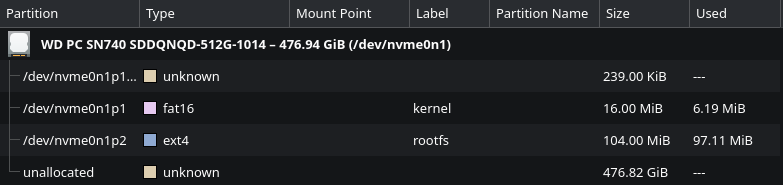
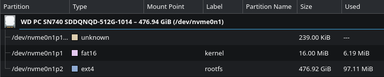

## Proxmox Quick Little Fixes
The fix that I need to do in Proxmox is to disable the enterprise subscriptions in Proxmox. So I headed towards `pve` -> `Updates` -> `Repositories`.  From there, Proxmox was telling me that I have two enterprise repos enabled, but I dont have a subscription for it. 


*Proxmox warning me that  I don't have a subscription for the enterprise repos.*

I then went to disable them by selecting the first enterprise repo on the list, which was `https://enterprise.proxmox.com/debian/ceph-squid`, and clicking on disabled. I then did the same for `https://enterprise.proxmox.com/debian/pve` repo.


*Selecting the enterprise ceph repo to disable.*

Then Proxmox was warning me that I don't have any Proxmox VE repos enabled. So I clicked on `Add`, and added the `No-Subscription` repo.


*The repo for the users who don't have a subscription key.*

Then, I went to `pve` -> `Updates` to update the machine. But first, I have to click on the `Refresh` button at the top. After waiting to refresh, I then clicked on the `Upgrade` button, and waited for everything to update.

Next I wanted to change the Proxmox password into something more reasonable. So I clicked on the `root@pam` user in the top right, and selected `Password`. Then I changed the password.


*Changing the password for Proxmox.*
## OpenWrt Quick Little Fixes
The issue that I have with OpenWrt is that GRUB isn't timing out to a boot option after 5 seconds. That means that I have to manually press the enter button to make it actually boot into OpenWrt. I did tried spending some time looking around the web for the answer, but the problem is that most of the web posts are about using grub on a generic Linux Distro. Which is expected since most people aren't using GRUB on their old laptops.

That's when I decided to use Google's Gemini to help me out here. At first, it tried to make me modify the `/etc/default/grub` file for the official way of configuring GRUB. However, that file didn't exist for me. So it tried `/etc/config/grub`, but that one also didn't exist for me. They might have exist if I was using the SquashFS filesystem, instead of the ext4 file system. So Gemini has decided to modify the direct file that GRUB boots into. So I gave Gemini the contents of `/etc/boot/grub.cfg` file, and it found the issue. The first two lines that OpenWRT has insert into the file was the problem:

```bash
serial --unit=0 --speed=115200 --word=8 --parity=no --stop=1 --rtscts=off
terminal_input console serial; terminal_output console serial
```

The first line was setting up the serial connection. The second line was told to use both the console input/output **and the serial input/output**. So because of that GRUB was waiting for the serial input/output to be available before starting the timer. However, since the laptop has no serial connection, grub was waiting forever. To fix this, I replaced those lines with the following to remove serial from the config:

```bash
termianl_input console
terminal_output console
```

After rebooting, the timer works again. I also modified `set timeout="5"` to `set timeout="0"`  to make GRUB skip the boot options, and go straight into the kernel.

I then also went to go change the password used for OpenWRT to something more secure. So I went to `System` -> `Administration` -> `Router Password` section. Then I enter in a brand new password.


*Entering in a brand new password for OpenWrt.*

Then, I set OpenWrt to be in the correct timezone. So I went to `System` -> `System` -> `General Settings` section. From there, I change the timezone to be correct for me.


*OpenWrt's timezone being set to the correct timezone.*

I then went to `System` -> `Software` to update the system packages. I clicked on the `Update lists...` button first to know what needs to be updated. Then I click on the `Updates` tab to see what need to be updated. Finally, I clicked on `Upgrade...` on all 26 packages.


*Some of the packages that need to be upgraded.*

Something that was bothering me is that OpenWrt wouldn't ssh with the Kitty terminal, and OpenWrt only using 100MB out of the 512GB storage in the laptop.. To fix the Kitty SSH, I had to install the `coreutils-base64` into OpenWrt. To fix the storage, I will have to boot into a live Linux distro to expand it in there. From there, I just resize the `ext4` partition to take the entire disk.


*The disk partition table before the resize.*


*The disk partition table before the resize.*
## OpenMediaVault Quick Little Fixes

The first thing that I did was update the timezone by going to `System` -> `Date & Time`. Then I set the timezone to `Etc/GMT-5`.  I then applied the changes so it can be saved.


*The timezone being changed.*

Then I went into `Account` -> `Password` to change the default password. I set it to be something more reasonable.


*The OMV admin's password being changed.*

Then I went into `System` -> `Update Management` -> `Updates` to update the system. From there, I pressed the Arrow button to update the entire system.


*Updating OMV to the latest version.*