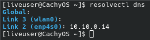
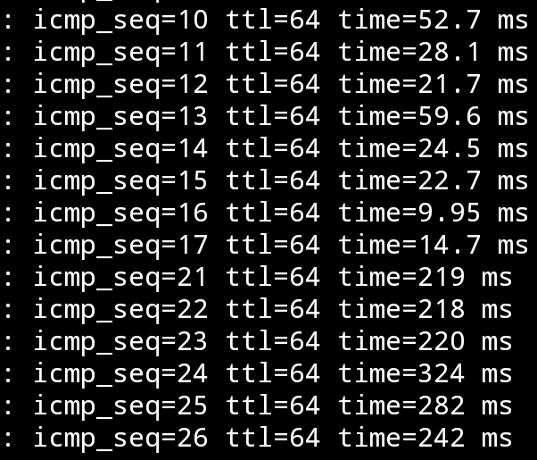
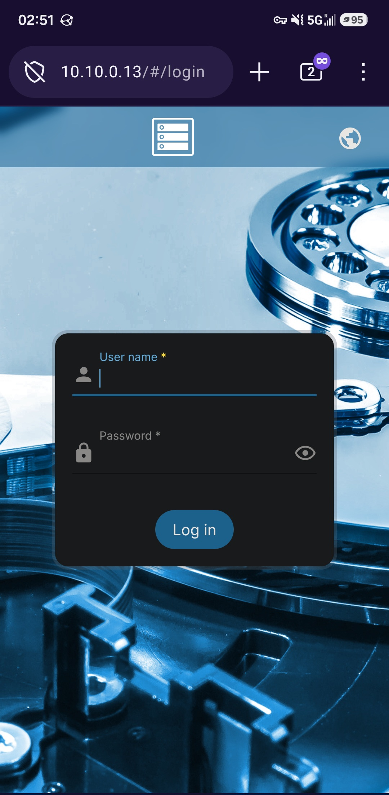

## The Plan
So after acquiring the [[Building the Home Lab Hardware|hardware for the Home Lab]], and [[Turning an Old Laptop into a Router|turning an old laptop into a basic router]], I am now ready to actually deploy services into the home lab. The first thing that I want to setup is all of the networking services that I need (so far). I did made a diagram for everything that I plan to host, so I can just focus on the networking stuff for now.


*The services I want to run on the laptop router.*

Not only that, but I should also plan out the network layout for the home lab. Because the homelab only has one router, and one switch, I felt like a traditional network topology wouldn't work out here. Plus, it wouldn't fully cover my plan for the subnet usage. So I went with a different diagram.


I went with a `/28` subnet mask instead of a `/24` mask because it's going to be a small home lab. A `/28` subnet mask can only have 14 devices, while a `/24` subnet mask can only have 254 devices. Having a smaller subnet will make broadcast packets more efficient as it has less devices to broadcast to.<sup>[1]</sup> While I could have gone with a `/29` to make it even more efficient, as it can only have 6 devices, a `/28` subnet mask will give me some extra wiggle room for future devices. 

I picked `10.10.0.0` as the network address for two reasons. The first one is that doing `192.168.1.0` or `10.0.0.0` would conflict with any existing current or future network addresses, especially with VPNs. The second reason is that going high up to `10.10.0.0` will make it much less likely to collide with those networks.

## Setting up the Device's IP.
With the device's IP set, I would now need to apply them. The first one has to be the Router. So aftering logging into OpenWrt Web UI, I went to  `Network` -> `Interfaces`. From there, I pressed `Edit` onto the LAN interface.


*The interface to edit in OpenWrt.*


From there, I can see the old network address and subnet. What I did then was add the `10.10.0.14/28` network address, and removed the old one.


*Swapping the old network address and subnet to the new one.*

Then I went to the `DHCP Server` tab and the`IPv4 Settings` sub tab. I modified the start and end ranges for DHCP to the values in the diagram.


*The DHCP lease range being modified for the network.*

From there, I then saved and applied the changes. Doing this made my CachyOS laptop lose connection to the network, which is expected. So I modified the network values, using the Network Manager's TUI.


*The new network values for the CachyOS laptop.*

After that, I was able to ping the laptop router from the CachyOS laptop. However, at some point, the pings started to get dropped. 


*The pings being dropped after some time has passed.*

Turns out, OpenWrt was auto reverting the changes to prevent the user from being locked out.<sup>[2]</sup> To prevent that from happening, I would have to access the router from the new IP before 90 seconds timer is up.<sup>[2]</sup> So after doing that, the timer is gone and now the new IP is permanent. 

I also rebooted my CachyOS laptop into Windows 11 ~~(ew)~~. Since I never set a static IP on Windows 11, I can check the DHCP IP assignment. And sure enough, it gave me a `10.10.0.6` address, throwing me into the first usable IP address inside the DHCP range.


*The IP address settings for Windows 11 via DHCP.*

The next thing I would need to do is set the IP addresses for the physical servers. I typed `192.168.` before I realized that I can't access them anymore. I realized that I should have done the router last, instead of first. But before I go changing the router IP addresses, I remember that I can add multiple IP addresses to it. So I set the router to temporary have `192.168.1.1/24` back.  


*Temporary adding `192.168.1.1/24` back to the network.*

And sure enough, OpenWrt has already added a route to that network, allowing me to access it.


*Being able to ping `192.168.1.253` from the `10.10.0.6`.*

From there, I then accessed Proxmox from the `192.168.1.253` IP address. From there, I went to `Datacenter` -> `pve` -> `System` -> `Network`.  I was able to see all of the network devices on the Dell box, including the wireless interface. I am planning to turn that wireless card into a AP, but that's a future project.


*The network settings on the Dell box.*

From there, I clicked on `Edit` on to the `vmbr0` interface. I then updated the IP settings.

*The new IP settings to set for the Dell Proxmox Box.*

After that, I clicked on `OK`, and then `Apply Configuration`. I then confirm the popup and waited a few seconds. After that, I visited the `https://10.10.0.12:8006` URL.  And sure enough, it worked.


*Accessing the Dell box from the new network IP.*
 
Now then, the final box I need to set is the OpenMediaVault (OMV) box. The interesting thing is that the default lease time is 12 hours. And since 12 hours have passed since I changed the network, OMV has already grabbed a new IP.


*OpenMediaVault's New IP from the lease.*

The funny part is that while the IP is correct, it's not suppose to get that from DHCP, as it's out of the range. I went back to the DHCP settings, and realised that  I misread `Limit` and `End`, since it's below `Start.` I changed the limit to 4, and that should lock it down to the correct range.


*The correct DHCP settings for the network.*

So I then logged into OMV's Web UI, and went to `network` -> `Interfaces`. It then showed me the only interface on the system, and the fact that it's set with DHCP. From there, I edited to use a static IP with the correct settings. Now I was forced to setup a DNS server, so I set it to the router, since I am planning on making it the DNS server.


*The OMV interface with it being set to DHCP.*


*The OMV interface set to the correct static IP.*


*The DNS server set on the interface.*

I then had to applied the changes. And since I got lucky with DHCP picking the correct IP address, I don't need to switch to OMV with the new IP before the changes get reverted.


*OMV now using static IP addressing.*

## Give me that DNS

Now I want to have OpenWRT to host the custom DNS for the lab.  I found the DNS option at `Network` -> `DNS`. From there, I saw the `DNS Reconds` tab, which I knew that's the place to put in custom records. From there, I clicked the add button inside the `Hostnames` tab. From there, it asked me what to set the hostname and IP address to, so I put in the one for OMV, since that one is the easiest to test. Then I saved and applied the changes.


*The settings set for the custom hostname.*

Then I modified the static IP settings for the CachyOS laptop to use OpenWrt as it's DNS server, and disconnect it from the Wi-Fi. This is to ensure that the Wi-Fi connection won't mess it up.  Finally, I went to `http://omv.lan`, and the paged loaded.


*OpenMediaVault being accessed from `http://omv.lan`*. 

I then re-enabled my Wi-Fi, and I can still use the domain. But speaking of the domain, I want to change the Top Level Domain (TLD), which is the `.lan` part of the domain,<sup>[3]</sup> to something else. While I could go with something generic like `.com`, `.org`, `.net`, `etc...`, I want it to be custom. So after some time thinking, I went with `.uhhhhh`.

I saw that the `Local domain` option in the `General` tab was set to `.lan`, so I thought that setting it to `.uhhhhh` would auto make OMV migrate to the new domain. However, it wouldn't work for me. I did spend some time trying to fix it, I couldn't figure it out. So I tried modifying the domain to include the TLD, and that worked.  So I then set the rest of the physical devices on the network.


*The `http://omv.uhhhhh` in action.*


*The custom DNS records in the home lab, so far.*

Now I just need to set the DHCP server to make the devices use the static server.  With me jumping around the static and DHCP version of the lease, as well as having the Wi-Fi connection running at the same time, I didn't want any cache of the CachyOS laptop to mess with it. So I booted into a live version of the CachyOS installer to test it, and it automatically set the laptop as the DNS server.


*The DNS server being set to the OpenWrt Laptop from the CachyOS installer.*

The last thing that I did is update Proxmox to use the DNS server. So I went to `pve` -> `System` -> `DNS`. From there, I updated it to the new info.


*Proxmox being updated to the new DNS info.*
## Tailscale
The next thing I want to set up is Tailscale. Tailscale is a VPN mesh<sup>[4]</sup>. It uses the Wireguard Protocol to create peer-to-peer or replayed VPN connections without having to port forward.<sup>[4]</sup> Using Tailscale will allow me to access the services outside of my dorm, without trying to convince the IT department to allow a random guy to poke holes in their firewall. 

While OpenWrt doesn't come with Tailscale, it does have a [official guide](https://openwrt.org/docs/guide-user/services/vpn/tailscale/start) to set one up. But before I can do that, I have to make a Tailscale account. Unfortunately, I am forced to use a SSO (Single Sign On) to make the account, and can't use email. I don't prefer this, as if an attacker gain access to the account used for SSO, then they can access everything that's linked to the account. But reguardless, I made the Tailscale account. 

I then went into the onboard progress on the website, until I got to the part where I have to link devices. For now, I will link my CachyOS laptop, and my phone, since they're *(in theory)* easier to setup. For my phone, I just installed the app, log into it, and the phone is connected. For the CachyOS laptop, I installed the  package for it, ran `sudo systemctl enable --now tailscaled && sudo tailscale up` to start the client. From there, it gave me a URL to log into with. I pasted it into the browser, and connected it to my account. I also ran `sudo tailscale set --operator=$USER` to be able to use the tailscale command without sudo permission.

Now I just need to connect the OpenWrt laptop. To do that, I would first need to install the `tailscale` pacakge. So I ran `apk update && apk add tailscale` into the terminal. From there, I do the same steps that I did with CachyOS, run `tailscale up` and paste the URL into my browser. Now all three devices are on the same mesh network. 


*All three devices showing up in the dashboard.*

However, when I try to ping the OpenWrt through Tailscale, I get a `Destination Port Unreachable` error. This might be because I didn't finish following the guide, as it says to create a new interface for Tailscale. So I went to `Network` -> `Interfaces` -> `Add new interface`. From there, I set the name to be `tailscale`, the Protocol t obe `Unmanaged`, and the device to be `tailscale0`.


*The new Tailscale interface creation settings.*

Then it wants me to create a new firewall zone for it by going to `Network` -> `Firewall` -> `Zones`
 -> `Add`. I then set it up with the following settings from the guide, since I haven't messed with OpenWrt's Firewall rules yet.
 - Name: tailscale
- Input: ACCEPT
- Output: ACCEPT
- Forward: reject
- Masquerading: on
- MSS Clamping: on
- Covered networks: tailscale
- Allow forward to destination zones: LAN
- Allow forward from source zones: LAN

From there, I saved and applied the settings. However, that still didn't worked. So I applied the oldest tech trick in the book, turning it on and off. And unsurprisingly, that fixed the problem. Not only that, but the phone was able to ping OpenWrt switching from the LAN's Wi-Fi to mobile data. 


*The ping logs for pinging OpenWrt laptop from switching from Wi-Fi to mobile data.*

But if it was just only able to ping OpenWrt, then it would be *(mostly)* useless to me. But I am able to access the OpenWrt's Web UI over Tailscale using mobile data.


*Access the OpenWrt's Web UI on mobile using Tailscale on mobile data.*

However, I am unable to access OMV and Proxmox, as they're not on the mesh network. Adding every device onto the mesh network would be too tedious. To fix that, I can add the `10.10.0.0/28` network as a Tailscale subnet. To do that, I have to run `tailscale up --advertise-routes=10.10.0.0/28 --snat-subnet-routes=false`. Now this command does survive across reboot, so it only has to be run once. From there, I go to the Tailscale's admin dashboard, click on the three dots on the same row as `openwrt`, and click on `Edit route settings...`. From there, the LAN network shows up as a subnet route, and I would just have to enable it. And now I can access OMV from the LAN IP.


*The network address showing up as a subnet route in Tailscale.*


*Being able to access OMV from my phone over data.*

The last thing I would need to do is setup Tailscale to use the custom DNS server. It took me quite a while for me to figure this out, as I was tunnel focus on the wrong thing. I was assuming that Tailscale wasn't using the local DNS server, despite setting it in the setting. So I spent a while trying to figure out why Tailscale wasn't using it. The first problem was that mobile Firefox was using it's own custom DNS server, but turning that off didn't fix it. The second, and the actual problem, took me a while to figure it out. But I eventually found out that OpenWrt's DNS server was only listening on the LAN interface. So after setting it to listen to both the LAN and Tailscale interface, I was able to get it to work. Although, I had to set Tailscale to not use the local device's DNS settings to make it actually use the OpenWrt's DNS Server.


*The DNS setting set in Tailscale. Note that the `Override DNS servers` setting is set to true.*


*The DNS/DHCP settings set to listen on both LAN and Tailscale interface.*
## Nginx
Now while I do have DNS working, it isn't setup that well. The problem is that the DNS server can't handle services on different port. So for example, accessing Proxmox requires me to enter is `https://pve.uhhhhh:8006` instead of just `https://pve.uhhhhh`. That's where Nginx comes in.  It is one of the most popular free and open source reverse proxy.<sup>[5]</sup> A reverse proxy is a single server that takes the clients request, and redirects it to the correct server.<sup>[6]</sup> The point of this is to be able to take the `https://pve.uhhhhh` domain request, and send it to `https://10.10.0.12:8006` without the user knowing.

But in order to do that, I would have to modify OpenWrt's WebUI. The reason why is that both the WebUI and Nginx uses port 80 & 443. They will be fighting with each other over the port. So I would have to change one of them, and the one being change is the WebUI. The reason why is that the user will be redirected to Nginx on port 80 & 443, with no way of changing it. Plus, I can use Nginx to redirect the changed port of the WebUI  without the user knowing. 

To do that, I would have to modify the configuration file for it. The WebUI uses httpd, so that is what I have to modify.<sup>[7]</sup> So I changed the contents of  `/etc/config/uhttpd`  to change the `listen_http` to be `0.0.0.0:888`, and `listen_https` to be `0.0.0.0:444`.<sup>[7]</sup> Then I ran `/etc/init.d/uhttpd restart` to restart the web interface.<sup>[7]</sup>


*Both the http and https ports of OpenWrt's WebUI are being accessed from non-standard ports.*

Now I can install Nginx via `apk add nginx`. From there, I can run `/etc/init.d/nginx enable && /etc/init.d/nginx start` to start, and I can navigate to it.


*The Nginx server running on the system.*

Now if you have worked with Nginx before, then you will know that being thrown into a `403 Forbidden` error page isn't normal. That's because OpenWrt ships Nginx with a custom preset.<sup>[8]</sup> Not only that the configuration directory for Nginx is dynamically generated by the UCI settings everytime it starts. So if I want to add a custom request, then I would have to add something like the following <sup>[9]</sup>:

```bash
uci set nginx.srv_grafana=server
uci set nginx.srv_grafana.uci_enable='true'
uci set nginx.srv_grafana.server_name='grafana.raspberrypi.home'
uci set nginx.srv_grafana.include='conf.d/grafana.locations'
uci set nginx.srv_grafana.ssl_certificate='/etc/nginx/ssl/wildcard.raspberrypi.home.crt'
uci set nginx.srv_grafana.ssl_certificate_key='/etc/nginx/ssl/wildcard.raspberrypi.home.key'
uci add_list nginx.srv_grafana.listen='443 ssl'
uci add_list nginx.srv_grafana.listen='[::]:443 ssl'
uci set nginx.srv_grafana.ssl_session_cache='shared:SSL:32k'
uci set nginx.srv_grafana.ssl_session_timeout='64m'
uci commit nginx
/etc/init.d/nginx restart
```

I don't like configuring it like that, as it would be annoying to try and reconfigure in the future. However I can disable that by running `uci set nginx.global.uci_enable=false` to disable that feature, and `uci commit nginx` to save that. Now Nginx will just act like any other Nginx, with all of the config files saved at `/etc/nginx`. So I then installed `git`, and start turn that directory into a repo for commits. Then I worked on setting it up for the home lab. 

I do want to use VScode for the remote SSH connection to make it easier to edit Nginx. I did try to SSH inside VScode, but it was throwing errors at me. I'm assuming that those errors are because OpenWrt is missing tools that VSCode need. So I instead look for an alternative method, and found SSHFS. SSHFS is a tool that allows you to mount remote directories over SSH.<sup>[10]</sup> To get it to work on OpenWrt, I would need to install the `openssh-sftp-server` package. Then I would just need to run `sshfs OpenWrt:/etc/nginx nginx` to mount the `/etc/nginx` folder on OpenWrt to the local folder called `nginx`.  Then I can just use VScode to edit. However, I did an issue with that. Because I am accessing the repo with a different user then user that created it, Git doesn't allow me to use it. I can force Git to trust me by using `git config --global --add safe.directory ~/nginx` . 

## HTTPS/SSL Certs
This is the last thing I would need to setup. HTTPS needs a SSL certs in order to encrypt the traffic, and to prevent man-in-the-middle attacks.<sup>[12]</sup> There are three ways of getting a SSL certs. The first option is to self sign the certificate. This allows you to generate the certificate on any machine for free.<sup>[13]</sup> But because the certificate was generated by a nobody, no one will trust it by default, so you will have to manually approve it on all browsers. <sup>[13]</sup>

The second option is the public certificate authority (CA). They are an organization that sign and provides the SSL certificates.<sup>[14]</sup> They are the third party that the client uses to enure that the website, and their SSL certificate, is owned by the right people.<sup>[14]</sup> Because of this, almost every client devices automatically trust them. The last option is the private certificate authority. It operates just like the public version but it's only accessible in the private network, and the client have to manually trust them.

The option that I went with is the private CA. I can't go with a public CA, as my domain is not a registed one, nor can't be because of the custom `.uhhhhh` TLD. While both the self sign and the private CA have the problem of having to manually trust them, I went with private CA because I never done that before. Because of that, I found a guide that [explains how to setup a private CA](https://deliciousbrains.com/ssl-certificate-authority-for-local-https-development) that I will be following. While the guide was made for Ubuntu, it should (in theory) work with OpenWrt.

The first step was to install openssl. To get that on OpenWrt, I had to install the `openssl-util` package. Then I ran `openssl genrsa -des3 -out openCA.key 2048` inside `/etc/certs` to create the private key for the CA. I did put in a passphrase for the key (not going to tell you what it is).  The next step is to make the root certificate via `openssl req -x509 -new -nodes -key openCA.key -sha256 -days 1825 -out openCA.pem`. The command did ask me some questions for the metadata of the certificate, but it doesn't matter that much. Now I have `openCA.key` for the private key, and `openCA.pem` for the root certififcate.

The next step is to install the root certificate onto the client devices to trust me. In my case, it would be the CachyOS laptop, the Windows 11 laptop, and my android phone. On CachyOS, the first step is to ensure that the `ca-certififcates` and the `p11-kit` package is installed. Then run `trust anchor --store openCA.pem` to import the certificate.<sup>[16]</sup> To ensure that the certificate is installed, you can use this command `awk -v cmd='openssl x509 -noout -subject' '/BEGIN/{close(cmd)};{print | cmd}' < /etc/ssl/certs/ca-certificates.crt | grep C=CA`. You should see the metadata of the certififcate appear. 

On my Samsung S24 Android, I first install the certificate. Then I went to `Settings `-> `Security and Privacy` -> `More Security Settings` -> `Install From Phone Storage` -> `CA certificate`. From there, I accepted the warning message and navigated to the cert file. Then it installed the certificate.  On other Android devices, searching `certificate` in settings should take you to a simillar spot.

On Windows 11, I had to download the root certificate. Then I open the "Microsoft Management Console" service. From there, I went to `File` -> `Add/Remove Snap-in`. I clicked on the `certificate` on the left side, and then clicked the `Add >` button to move it to the right side. I selected the `Computer Account` option in the popup for which level to manage the certificate. I then selected the local computer option. I then closed the window to get back to the main window, which has the option for certificates. Then I clicked on `Certificates (Local Computer)` -> `Third-Party Root Certificate Authorities`. In the middle of the empty screen, right click it -> `All Tasks` Import. I clicked Next on the wizard popup, and then browsed torwards my certificate. I then selected `Third-Party Root Certificate Authorities` as the location to store it. 

I got a popup telling me that the import was sucessful. However, it wouldn't show up in Firefox. I'm not sure why, so I just imported the cert into Firefox itself. I don't use Windows that much to really care about doing it the proper way.  

Now I can create the certificate for the domain to use. To do that, I need to first create the private key for the domain via `openssl genrsa -out openwrt.key 2048`.  Then I need to create a Certificate Signing Request (CSR) via `openssl req -new -key openwrt.key -out openwrt.csr`.  Just like the root CA, there will be questions asked to use in the metadata. Now I would need to make the X509 V3 certificate extenstion config that's for the Subject Alternative Name (SAN). To do that, I would need to place the following into `openwrt.ext` file.

``` toml
authorityKeyIdentifier=keyid,issuer
basicConstraints=CA:FALSE
keyUsage = digitalSignature, nonRepudiation, keyEncipherment, dataEncipherment
subjectAltName = @alt_names

[alt_names]
DNS.1 = openwrt.uhhhhh
```

Finally, I can generate the certificate with the CA private key, CSR, the CA certificate, and the config file via `openssl x509 -req -in openwrt.csr -CA openCA.pem -CAkey openCA.key -CAcreateserial -out openwrt.crt -days 825 -sha256 -extfile openwrt.ext`. Now I have a `uhhhhh.key` for the cert private key, and the `uhhhhh.crt` for the signed certififcate. Now I would just need Nginx to point to them. After after restarting Nginx, I now have https without having the pesky warning popup.


The guide does have a link to a shell script that can be used to make any future certificates easier. So I will be using this until I learn how to use ansible. I did slightly modify it to work in my scenario.

``` bash
#!/bin/sh

if [ "$#" -ne 1 ]
then
  echo "Usage: Must supply a domain"
  exit 1
fi

DOMAIN=$1

cd /etc/certs

openssl genrsa -out $DOMAIN.key 2048
openssl req -new -key $DOMAIN.key -out $DOMAIN.csr

cat > $DOMAIN.ext << EOF
authorityKeyIdentifier=keyid,issuer
basicConstraints=CA:FALSE
keyUsage = digitalSignature, nonRepudiation, keyEncipherment, dataEncipherment
subjectAltName = @alt_names
[alt_names]
DNS.1 = $DOMAIN
EOF

openssl x509 -req -in $DOMAIN.csr -CA ./openCA.pem -CAkey ./openCA.key -CAcreateserial \
-out $DOMAIN.crt -days 825 -sha256 -extfile $DOMAIN.ext
```

## Related Repo
[Nginx](https://github.com/Mr-Tinkerer/openwrt-nginx)


## Citations
> [1] Meghna Meghwani. (2025, November 22). _Why subnetting matters: A simple guide_. ServerAvatar | the First, Fully Hybrid Cloud Hosting Solution. https://serveravatar.com/what-is-subnetting-and-why-it-matters/#why-subnetting-matters-1
> [2] OpenWrt Wiki Contributors. (2026, March 9). _[OpenWrt Wiki] Change LAN IP in LuCI (to an IP on a different subnet)_. Openwrt.Org. https://openwrt.org/faq/change_lan_ip
> [3] Wikipedia Contributors. “Fully Qualified Domain Name.” _Wikipedia_, Wikimedia Foundation, 4 Sept. 2020, https://en.wikipedia.org/wiki/Fully_qualified_domain_name. Accessed 28 July 2026.
> [4] Wikipedia Contributors. “Tailscale.” _Wikipedia_, Wikimedia Foundation, 17 Dec. 2025, [https://en.wikipedia.org/wiki/Tailscale](https://en.wikipedia.org/wiki/Tailscale). Accessed 28 July 2026.
> [5] Wikipedia Contributors. “Nginx.” _Wikipedia_, Wikimedia Foundation, 29 Aug. 2019, https://en.wikipedia.org/wiki/Nginx. Accessed 29 July 2026.
> [6] Wikipedia Contributors. “Reverse Proxy.” _Wikipedia_, Wikimedia Foundation, 25 Jan. 2020, https://en.wikipedia.org/wiki/Reverse_proxy. Accessed 29 July 2026.
> [7] OpenWrt Wiki Contributors. “[OpenWrt Wiki] uHTTPd Webserver.” _Openwrt.Org_, 26 July 2025, https://openwrt.org/docs/guide-user/services/webserver/http.uhttpd. Accessed 29 July 2026.
> [8] OpenWrt Wiki Contributors. “[OpenWrt Wiki] Nginx Webserver.” _Openwrt.Org_, 5 July 2022, https://openwrt.org/docs/guide-user/services/webserver/nginx#openwrt_s_defaults.
> [9]Natsuki. “Why I Run Nginx on My OpenWrt Router (and How You Can Too).” _DEV Community_, 16 Jan. 2026, https://dev.to/tsukiyo/why-i-run-nginx-on-my-openwrt-router-and-how-you-can-too-4h5i#4-installing-nginx-on-openwrt. Accessed 30 July 2026.
> [10] Wikipedia Contributors. “Sshfs.” _Wikipedia_, Wikimedia Foundation, 11 July. 2024, https://en.wikipedia.org/wiki/SSHFS. Accessed 30 July 2026.
> [11] OpenWrt Wiki Contributors. “Testing to Determine If You Are a Bot!” _Openwrt.Org_, 5 Dec. 2022, https://openwrt.org/docs/guide-user/services/ssh/sshfs.server. Accessed 31 July 2026.
> [12] Wikipedia Contributors. “Https.” _Wikipedia_, Wikimedia Foundation, 8 Dec. 2018, https://en.wikipedia.org/wiki/HTTPS. Accessed 1 August 2026.
> [13] Wikipedia Contributors. “Self-Signed Certificate.” _Wikipedia_, Wikimedia Foundation, 17 Aug. 2022, https://en.wikipedia.org/wiki/Self-signed_certificate. Accessed 1 August 2026.
> [14] Wikipedia Contributors. “Certificate Authority.” _Wikipedia_, Wikimedia Foundation, 9 Jan. 2020, https://en.wikipedia.org/wiki/Certificate_authority. Accessed 1 August 2026.
> [15] Touesnard, Brad. “How to Create Your Own SSL Certificate Authority for Local HTTPS Development.” _Delicious Brains_, 23 Nov. 2021, https://deliciousbrains.com/ssl-certificate-authority-for-local-https-development/. Accessed 1 August 2026.
>  [16] Arch Wiki Contributors. “Transport Layer Security - ArchWiki.” _Archlinux.Org_, 15 June 2025, https://wiki.archlinux.org/title/Transport_Layer_Security#Certificate_authorities. Accessed 1 August 2026.
